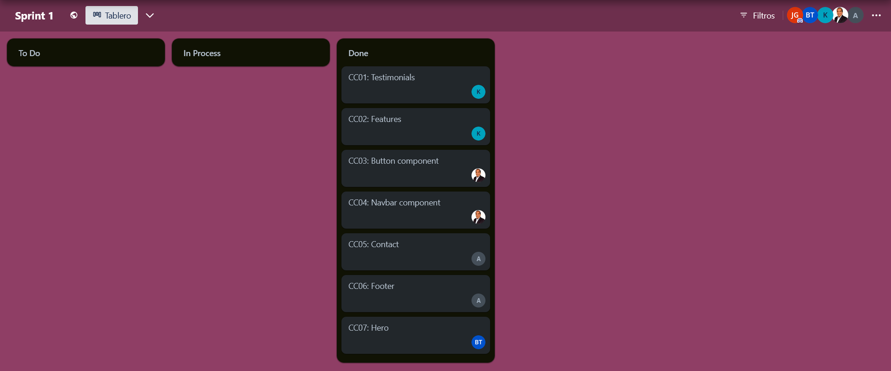

<hr>

# <center>COURSE PROJECT</center>

<p align="center">
    <strong>Universidad Peruana de Ciencias Aplicadas</strong><br>
    </img><br>
    <strong>Ingeniería de Software</strong><br>
    <strong>Desarrollo de Aplicaciones Open Source - SW53</strong><br>
    <strong>Profesor: Elio Jefferson Navarrete Vilca </strong><br>
    <br>INFORME DEL TRABAJO FINAL
</p>

<center>

#### Startup: **XXXXXX**
#### Product: **XXXXXX**

</center>

# Team  Members:
<center>

| Member                   | Code       |
| ------------------------ | ---------- |
| Nombre del Compañero XXX | u202217485 |
| Nombre del Compañero XXX | u202217485 |
| Nombre del Compañero XXX | u202217485 |
| Nombre del Compañero XXX | u202217485 |
| Nombre del Compañero XXX | u202217485 |
</center>

# Registro de Versiones del Informe

| Version | Fecha      | Autor   | Descripcion de Modificacion |
| ------- | ---------- | ------- | --------------------------- |
| 0.0     | 19/03/2024 | Grupo 1 | Se crea el documento        |

# Project Report Collaboration Insights

[URL del repositorio](https://www.example.com)

(Imagenes de los commits cada entrega)

# Contenido

[Registro de Versiones del Informe](#registro-de-versiones-del-informe)

[Project Report Collaboration Insights](#project-report-collaboration-insights)

[Student Outcome](#student-outcome)

[Capítulo I: Introducción](#capítulo-i-introducción)

[1.1 Startup Profile](#11-startup-profile)  
[1.1.1. Descripción de la Startup](#111-descripción-de-la-startup)  
[1.1.2. Perfiles de integrantes del equipo](#112-perfiles-de-integrantes-del-equipo)

[1.2. Solution Profile](#12-solution-profile)  
[1.2.1 Antecedentes y problemática](#121-antecedentes-y-problemática)  
[1.2.2 Lean UX Process.](#122-lean-ux-process)  
[1.2.2.1. Lean UX Problem Statements.](#1221-lean-ux-problem-statements)  
[1.2.2.2. Lean UX Assumptions.](#1222-lean-ux-assumptions)  
[1.2.2.3. Lean UX Hypothesis Statements.](#1223-lean-ux-hypothesis-statements)  
[1.2.2.4. Lean UX Canvas.](#1224-lean-ux-canvas)

[1.3. Segmentos objetivo.](#13-segmentos-objetivo)

[Capítulo II: Requirements Elicitation & Analysis](#capítulo-ii-requirements-elicitation--analysis)

[2.1. Competidores](#21-competidores)  
[2.1.1. Análisis competitivo]()  
[2.1.2. Estrategias y tácticas frente a competidores](#211-análisis-competitivo)

[2.2. Entrevistas](#22-entrevistas)  
[2.2.1. Diseño de entrevistas](#221-diseño-de-entrevistas)    
[2.2.3. Análisis de entrevistas](#223-análisis-de-entrevistas)

[2.3. Needfinding](#23-needfinding)  
[2.3.1. User Personas](#231-user-personas)  
[2.3.2. User Task Matrix](#232-user-task-matrix)  
[2.3.3. User Journey Mapping](#233-user-journey-mapping)  
[2.3.4. Empathy Mapping](#234-empathy-mapping)  
[2.3.5. As-is Scenario Mapping](#235-as-is-scenario-mapping)

[2.4. Ubiquitous Language](#24-ubiquitous-language)

[Capítulo III: Requirements Specificatio](#capítulo-iii-requirements-specification)

[3.1. To-Be Scenario Mapping](#31-to-be-scenario-mapping)

[3.2. User Stories](#32-user-stories)

[3.3. Impact Mapping](#33-impact-mapping)

[3.4. Product Backlog](#34-product-backlog)

[Capítulo IV: Product Desig](#capítulo-iv-product-design)

[4.1. Style Guidelines](#41-style-guidelines)  
[4.1.1. General Style Guidelines](#411-general-style-guidelines)  
[4.1.2. Web Style Guidelines](#412-web-style-guidelines)

[4.2. Information Architecture](#42-information-architecture)  
[4.2.1. Organization Systems](#421-organization-systems)  
[4.2.2. Labeling Systems](#422-labeling-systems)  
[4.2.3. SEO Tags and Meta Tag](#423-seo-tags-and-meta-tags)  
[4.2.4. Searching Systems](#424-searching-systems)   
[4.2.5. Navigation Systems](#425-navigation-systems)

[4.3. Landing Page UI Design](#43-landing-page-ui-design)   
[4.3.1. Landing Page Wireframe](#431-landing-page-wireframe)  
[4.3.2. Landing Page Mock-up](#432-landing-page-mock-up)

[4.4. Web Applications UX/UI Design](#44-web-applications-uxui-design)  
[4.4.1. Web Applications Wireframes](#441-web-applications-wireframes)  
[4.4.2. Web Applications Wireflow Diagrams](#442-web-applications-wireflow-diagrams)  
[4.4.2. Web Applications Mock-ups](#442-web-applications-mock-ups)   
[4.4.3. Web Applications User Flow Diagrams](#443-web-applications-user-flow-diagrams)

[4.5. Web Applications Prototyping](#45-web-applications-prototyping)

[4.6. Domain-Driven Software Architecture](#46-domain-driven-software-architecture)  
[4.6.1. Software Architecture Context Diagram](#461-software-architecture-context-diagram)  
[4.6.2. Software Architecture Container Diagrams](#462-software-architecture-container-diagrams)  
[4.6.3. Software Architecture Components Diagrams](#463-software-architecture-components-diagrams)

[4.7. Software Object-Oriented Design](#47-software-object-oriented-design)  
[4.7.1. Class Diagrams](#471-class-diagrams)  
[4.7.2. Class Dictionary](#472-class-dictionary)

[4.8. Database Design](#48-database-design)  
[4.8.1. Database Diagram](#481-database-diagram)

[Capítulo V: Product Implementation, Validation & Deploymen](#capítulo-v-product-implementation-validation--deployment)

[5.1. Software Configuration Management](#51-software-configuration-management)  
[5.1.1. Software Development Environment Configuration](#511-software-development-environment-configuration)  
[5.1.2. Source Code Management](#512-source-code-management)  
[5.1.3. Source Code Style Guide & Conventions](#513-source-code-style-guide--conventions)  
[5.1.4. Software Deployment Configuration](#514-software-deployment-configuration)

[5.2. Landing Page, Services & Applications Implementation](#52-landing-page-services--applications-implementation)  
[5.2.1. Sprint 1 ](#521-sprint-1)  
[5.2.1.1. Sprint Planning 1](#5211-sprint-planning-1)  
[5.2.1.2. Sprint Backlog 1](#5212-sprint-backlog-1)  
[5.2.1.3. Development Evidence for Sprint Review](#5213-development-evidence-for-sprint-review)  
[5.2.1.4. Testing Suite Evidence for Sprint Review](#52x4-testing-suite-evidence-for-sprint-review)  
[5.2.1.5. Execution Evidence for Sprint Review](#52x5-execution-evidence-for-sprint-review)  
[5.2.1.6. Services Documentation Evidence for Sprint Review](#52x6-services-documentation-evidence-for-sprint-review)  
[5.2.1.7. Software Deployment Evidence for Sprint Review](#52x7-software-deployment-evidence-for-sprint-review)  
[5.2.1.8. Team Collaboration Insights during Sprint](#52x8-team-collaboration-insights-during-sprint)

[5.3. Validation Interviews](#53-validation-interviews)  
[5.3.1. Diseño de Entrevistas](#531-diseño-de-entrevistas)  
[5.3.2. Registro de Entrevistas](#532-registro-de-entrevistas)  
[5.3.3. Evaluaciones según heurísticas](#533-evaluaciones-según-heurísticas)

[5.4. Video About-the-Product](#54-video-about-the-product)

[Conclusiones](#conclusiones)

[Conclusiones y recomendaciones](#conclusiones-y-recomendaciones)

[Video About-the-Team](#video-about-the-team)

[Bibliografía](#bibliografía)

[Anexos](#anexos)

# Student Outcome

| Criterio Especifico                                                                                                                                  | Acciones Realizadas                                     | Conclusiones           |
| ---------------------------------------------------------------------------------------------------------------------------------------------------- | ------------------------------------------------------- | ---------------------- |
| Participa en equipos multidisciplinarios con eficacia, eficiencia y objetividad, en el marco de un proyecto en soluciones de ingeniería de software. | Compañero1:<br> *TB1:*  Su texto *TB2:* texto etc..     | Su texto de conclusion |
| Conoce al menos un sector empresarial o dominio de aplicación de soluciones de software.                                                             | Compañero1:<br> *TB1:*  Su texto<br> *TB2:* texto etc.. | Su texto de conclusion |

# Capítulo I: Introducción

## 1.1. Startup Profile

### 1.1.1. Descripción de la Startup

Texto del proyecto

#### 1.1.2. Perfiles de integrantes del equipo

| Miembros del equipo                             | Codigo Estudiante | Carrera                | Conocimientos / Habilidades |
| ----------------------------------------------- | ----------------- | ---------------------- | --------------------------- |
| Compañero 1 	 | U20...            | Ingenieria de software | C++, phyton .etc            |

## 1.2. Solution Profile

### 1.2.1 Antecedentes y problemática

Investigacion (5w, 2h tbn)

### 1.2.2 Lean UX Process.

#### 1.2.2.1. Lean UX Problem Statements.

Texto

#### 1.2.2.2. Lean UX Assumptions.

| Business Assumptions | User Assumptions |
| -------------------- | ---------------- |
| 1. - 12.             | 1. - 6.          |

#### 1.2.2.3. Lean UX Hypothesis Statements.

Texto

#### 1.2.2.4. Lean UX Canvas.

(imagen con texto)

## 1.3. Segmentos objetivo.

|                           | Segmento 1 | Segmento 2 |
| ------------------------- | ---------- | ---------- |
| Variables                 |            |            |
| Geográfica                |            |            |
| Demográfica               |            |            |
| Psicológica               |            |            |
| Función de comportamiento |            |            |

---

# Capítulo II: Requirements Elicitation & Analysis

## 2.1. Competidores.

### 2.1.1. Análisis competitivo.

| Competitive Analysis Landscape        |     |
| ------------------------------------- | --- |
| ¿Por qué llevar a cabo este análisis? | --  |

|                     |                                                       | (Nosotros)                                                                                                                     | Competidor                                                                  | Comptdor                                             |
| ------------------- | ----------------------------------------------------- | ------------------------------------------------------------------------------------------------------------------------------ | --------------------------------------------------------------------------- | ---------------------------------------------------- |
| PERFIL              | Overview                                              | lorem                                                                                                                          | ipsum                                                                       | lorem                                                |
|                     | Ventaja competitiva ¿Qué valor ofrece a los clientes? | ipsu                                                                                                                           | impuz                                                                       |
|                     | Mercado Objetivo                                      | Jeda                                                                                                                           | asa                                                                         | asa2                                                 |
| Perfil de marketing | Estrategia de Marketing                               | Redes Sociales                                                                                                                 | Redes Sociales                                                              | Televisión, Redes Sociales                           |
| Perfil del producto | Productos y servicios                                 | Elementos Gráficos Interactivos Enseñanza de Matemáticas Lúdica y Autodidacta Educación matemática interactiva Ámbito Freemium | Educación matemática interactiva Mas de 100 cursos en 28 idiomas diferentes | Educación general interactiva Contratos con Movistar |
|                     | Precios y costos                                      | Freemium (Cuenta Premium permite personalizar los juegos) Gratis                                                               | Gratuito                                                                    | Gratuito                                             |
|                     | Canales de distribución (Web y/o Móvil)               | Web y Móvil Web                                                                                                                | Móvil Web                                                                   | Web y móvil Web                                      |

### 2.1.2. Estrategias y tácticas frente a competidores.

| Competidores -> |               | Nosotros | Competidor2 | Competidor3 |
| --------------- | ------------- | -------- | ----------- | ----------- |
| Análisis SWOT   | Fortalezas    | lorem    | Lorem       | lorem       |
|                 | Debilidades   | lorem    | lorem       | lorem       | lorem |
|                 | Oportunidades | lorem    | lorem       | lorem       | lorem |
|                 | Amenazas      | lorem    | lorem       | lorem       | lorem |

## 2.2. Entrevistas.

### 2.2.1. Diseño de entrevistas.

**Preguntas generales:**

1. ¿Cuál es su nombre?
2. ¿Qué edad tiene?
3. ¿A qué se dedica?
4. ¿[Opinion de idea de propuesta]?

**Entrevistas usuario segmento 2**

1. ¿Lorem?
2. ¿Lorem?
3. ¿Lorem?
4. ¿Lorem?

**Entrevistas usuario segmento 2**

1. ¿Lorem?
2. ¿Lorem?
3. ¿Lorem?
4. ¿Lorem?

### 2.2.2. Registro de entrevistas.

**Segmento 1**  
Nombre: _____
Edad: _ años
Ocupación: _____  
  
{texto mucho}

**Segmento 2**  
Nombre: _____
Edad: _ años
Ocupación: _____  

{texto}

### 2.2.3. Análisis de entrevistas.

**Segmento 1:**
{texto}
**Segmento 2:**
{texto}

## 2.3. Needfinding.

### 2.3.1. User Personas.

**Segmento 1:**  


**Segmento 2:**


### 2.3.2. User Task Matrix.

| ---  | ------  | Segmento 1  | ------/----- | Segmento 2  | ---------- |
| ---- | ------- | ----------- | ------------ | ----------- | ---------- |
| ID   | Titulo  | Importancia | Frecuencia   | Importancia | Frecuencia |
| U01X | {Texto} | Alta        | Alta         | Media       | Baja       |

### 2.3.3. User Journey Mapping.

**Registration:**
Why would they trust us?

- s
- s
- s

**Onboarding and first use:**
How can they feel successful?

- s
- s
- s

**Sharing:**
Why would they invite others?

- s
- s
- s

### 2.3.4. Empathy Mapping.

**Segmento 1:**


**Segmento 2:**


### 2.3.5. As-is Scenario Mapping.

**Segmento 1**  
Escenario: {escenario}

As Is:
| Fases    | Fase 1 | Fase 2 | Fase 3 | Fase 4 |
| -------- | ------ | ------ | ------ | ------ |
| Doing    | texto  | texto  | texto  | texto  |
| Thinking | texto  | texto  | texto  | texto  |
| Feeling  | texto  | texto  | texto  | texto  |

**Segmento 2**  
Escenario: Dificultad para entender Matemáticas

As Is:
| Fases    | Fase 1 | Fase 2 | Fase 3 | Fase 4 |
| -------- | ------ | ------ | ------ | ------ |
| Doing    | texto  | texto  | texto  | texto  |
| Thinking | texto  | texto  | texto  | texto  |
| Feeling  | texto  | texto  | texto  | texto  |

## 2.4. Ubiquitous Language.

```
Texto ubiquo: Definicion de este
```

---

# Capítulo III: Requirements Specification

## 3.1. To-Be Scenario Mapping.

Segmento 1:

| Fases    | fase 1 as is | fase 2 | fase 3 |
| -------- | ------------ | ------ | ------ |
| Doing    |              | texto  | texto  | texto | texto |
| Thinking |              | texto  | texto  | texto | texto |
| Feeling  |              | texto  | texto  | texto | texto |

Segmento 2:
| Fases    | fase 1 as is | fase 2 | fase 3 |
| -------- | ------------ | ------ | ------ |
| Doing    |              | texto  | texto  | texto | texto |
| Thinking |              | texto  | texto  | texto | texto |
| Feeling  |              | texto  | texto  | texto | texto |

## 3.2. User Stories.

| HU0X | Historia Usuario | "Descripcion" |
| ---- | ---------------- | ------------- |

## 3.3. Impact Mapping.


## 3.4. Product Backlog.

| #Orden | User Story ID | Titulo     | Descripción | Story Points (1/2/3/5/8) |
| ------ | ------------- | ---------- | ----------- | ------------------------ |
| 1      | HU01          | titulo his | desc        | 5                        |

# Capítulo IV: Product Design

## 4.1. Style Guidelines.

### 4.1.1. General Style Guidelines.

Descripcion del porque estos elementos seran importantes

**Color:** (Descripcion de los colores escogidos y porque)  


**Tipografia:** (Descripcion de la tipografia escogida para el proyecto y porque)

**Branding** (Describir logotipo y porque)


### 4.1.2. Web Style Guidelines.

Descripcion de los elementos que se utilizaran en el web app

**Background:** (primary, secondary, terniary)  

**Text Styles:** (H1, H2, p, a,)  

**Button Styles:** (Button, dropdowns, Switches)

**Icons:** (Fondo blanco con los iconos que vamos a usar)

**Misc** (Cosas como nav var o slideshows que pensemos usar)


## 4.2. Information Architecture.

### 4.2.1. Organization Systems.

Descripcion corta respecto a los sistemas de organizacion que usaremos  (Escoger)
"Hierarchical. This structures advices to present the content in a way to distinguish the level of importance by making
use of physical differences, such as size, colour, contrast, alignment etc.

Sequential. Guide users to follow a specific path towards their goal and provide content step-by-step based on the
current step.

Matrix. You can always give the users the option to choose the type of navigation they prefer, i.e. Alphabetical,
Chronological, by topic."

### 4.2.2. Labeling Systems.

The labeling system aims at uniting the data effectively and represent them in simple way and avoid confusing great
amount of information. A widely adopted way to achieve this is by creating the labels which represent loads of data in
few words.

Como decir "home, about us, etc" basicamente lo que iria en un nav var y asi

### 4.2.3. SEO Tags and Meta Tags

**Meta & SEO (Search Engine Optimization) Tags:**  sirven para que la pagina web sea encontrada facilmente es lo que
sale al encontrar la pagina en el buscador (se ponen en el <"head">)

* Titulo: ```<title> ___ </title> ```
* Descripcion: ```<meta name = "description" content = "texto descipcion"/> ```
* Palabras Clave: ```<meta name = "keyword" content = "keyword1, 2 3"/> ```

### 4.2.4. Searching Systems.

**Que se busca?:** Que buscara el usuario  
**Que resultados se mostraran?:** Que se mostrara  
**Interface de busqueda:** Descripcion de como ayuda a encontrar lo deseado


### 4.2.5. Navigation Systems.

Basicamente aqui definimos como funciona la navegacion del web app
**Hierarchical Navigation System:** Main page a destination pages.
**Global Navigation Systems** (Complemento del Hierachical) Movimiento vertical (te mueves por la pagina)con nav(debe
poder regresar a la principal)
**Local Navigation Systems** (vas a otras paginas) (complemento del global nav sistem sub-site) Usas otras paginas

## 4.3. Landing Page UI Design.

### 4.3.1. Landing Page Wireframe.

la pagina donde te registras y ves info del web app (te manda al web app)

Wireframe es todo lo funcional de la pagina


### 4.3.2. Landing Page Mock-up.

Mockup es todo lo relacionado al diseño de la pagina


## 4.4. Web Applications UX/UI Design.

### 4.4.1. Web Applications Wireframes.

lo funcional de cada aspecto del wireframe


### 4.4.2. Web Applications Wireflow Diagrams.

Wireflow es como se va a navegar por la pagina (boton me lleva a esta pagina y este me regresa)


### 4.4.2. Web Applications Mock-ups.

Diseño en todo aspecto


### 4.4.3. Web Applications User Flow Diagrams.

un flow diagram de como el usuario utilizara la pagina **[PARA CADA USER GOAL]**


## 4.5. Web Applications Prototyping.

[URL del Prototipo (Hecho en figma)](https://www.example.com)

## 4.6. Domain-Driven Software Architecture.

### 4.6.1. Software Architecture Context Diagram.

1. System Context Diagram: Diagrama que muestra la relacion del aplicativo con los usuarios
   se incluyen servicios externos (si hay pocos bounded context se incluyen ahi)

2. Bounded Context Map: Muestra la relacion entre bounded contexts (los bounded context son como una burbuja que
   encapsula palabras clave en los procesos para poder
   diferenciarlos [Ej. Bounded context enfocado en las ventas(ventas), otro en revisar el stock(gestion) y otro enfocado en los proveedores (suministros)])
   Se hace como un brainstorm y se ve en que pueden conectarse o
   comunicarse [se usa un circulo entre conexiones lineales (upstream o downstream) para definir comunicacion, algunos context se pueden integrar para representar por ejemplo un share model por database, tambien se mencionan los (third party context para definir los restful apis)]

### 4.6.2. Software Architecture Container Diagrams.

1. Bounded Context Deployable / Container Diagrams. Sirve para entender como funciona y el proceso, Se especifican DB's,
   indexers, Search engine, las Apis que usen los bounded context y se conectan por flechas, las cuales tienen como
   objetivo explicar la direcion y relacion junto a que se esta enviando/comunicando (TCP)

### 4.6.3. Software Architecture Components Diagrams.

1. Component diagrams: Estos van a mostrar las ordenes, procesos, mensajes y componentes utilizados en el uso del
   aplicativo, claro se deben hacer diferentes de estos para cada bounded o USER GOALS

## 4.7. Software Object-Oriented Design.

### 4.7.1. Class Diagrams.

Esta yaselasaben (diagrama de clases)
Clases(name), objetos(nombre-objeto [como objeto]), metodos("Accion") y atributos(Correo, edad,nombre como valor, ID)

### 4.7.2. Class Dictionary.

Inherit (ave(superclase) -> (subclase)canario )
Polymorphism (Ej. funcion de persona hablar() -> Peruano hablar() , Gringo hablar() todos tienen una funcion que
contiene persona y van cambiando sus formas)
Abstraction (Ej. Solo muestra el usuario, pero esta su edad, correo y veces usada que uso app en la base de datos (fuera
de vista))
Encapsulation (cuando tienes tus variables y metodos en la misma clase las estas encapsulando, aun mas se encapsulan en
Private y Public )

## 4.8. Database Design.

### 4.8.1. Database Diagram.

Diagrama de base de datos (la relacion entre clases PK FK el Normalizar tmbn, isiyisi 🕸)

# Capítulo V: Product Implementation, Validation & Deployment

## 5.1. Software Configuration Management.

En la siguiente sección, detallaremos las herramientas, convenciones, referencias y configuraciones empleadas a lo largo del desarrollo del proyecto, que contribuyeron a mantener la consistencia en el trabajo realizado.

### 5.1.1. Software Development Environment Configuration.

En este apartado, se van a mencionar los distintos productos de software empleados por el equipo de desarrollo, para llevar acabo las actividades relacionadas con la elaboración del proyecto.

**Project Management:**

1. **Discord: https://discord.com/** Aunque originalmente su uso es mas para la comunidad de gamers para comunicarse entre ellos, Discord también se puede utilizar para mejorar la experiencia del usuario a travez de diferentes lugares de comunicación, fijar mensajes, diferentes canales de texto y actividad de los integrantes del grupo.

2. **WhatsApp: https://web.whatsapp.com/** WhatsApp es una aplicación de mensajería instantánea que se utiliza para la comunicación en tiempo real. Aunque no es una herramienta de gestión de proyectos, se puede utilizar para mantener en contacto con los miembros del equipo. 

**Requirements Managemnts:**

1. **Trello: https://trello.com/** Es un software de gestión de proyectos, que facilita asignar y organizar las tareas a realizar. 


**Product UX/UI Design**

1. **Figma: https://www.figma.com/** Figma es una herramienta de edición gráfica, en donde se puede diseñar y prototipar páginas web. Se utilizó para crear los wireframes, mock-ups del proyecto

2. **UXPressia: https://uxpressia.com/** Es una herramienta en línea que permite a los equipos de trabajo identificar y comprender los problemas, necesidades y comportamiento del usuario, lo utilizamos para realizar el Empathy Map, Journey Map, Impact Map

3. **Miro: https://miro.com/es/** Es una plataforma colaborativa el cual permite crear y usar pizarras digitales personalizadas en tiempo real. Lo utilizamos para la creación del As-is y To-Be scenario map.

**Software Development:**

1. **Landing Page:** Para la creación de la landing page, se utilizaron las tecnologias base del desarrollo web: HTML5, CSS3 y JavaScript, Tambien se usó ReactJs y el framework Tailwindcss para facilitar el desarrollo del proyecto.

**Software Documentation:**

1. **GitHub: https://github.com/** GitHub es una plataforma de desarrollo colaborativo que utiliza el sistema de control de versiones Git. Se utiliza para alojar, revisar y colaborar en proyectos de desarrollo de software, lo que facilita la colaboración entre desarrolladores.

2. **LucidChart: https://lucid.app/** LucidChart es una plataforma que cuenta con opciones para la creación de diagramas, mapas mentales, flujos y más, con el uso de plantillas y tableros con edición en tiempo real. Fue utilizado en el desarrollo del diagrama de clases UML

3. **Structurizr: https://www.structurizr.com/** Es una plataforma que permite modelado de diagramas de arquitectura de software por medio de código. Structurizr fue utilizado para crear el modelo C4 de nuestro proyecto.


### 5.1.2. Source Code Management.

El gitjab donde tengamos el proyecto

### 5.1.3. Source Code Style Guide & Conventions.
En el proyecto hemos hecho uso de algunas convenciones y guia de estilos para el desarrollo del Landing Page.

**React:**

   + Componentes: Se fomenta la creación de componentes para mantener un código limpio y modularizado.
   + Nomenclatura Descriptiva: Utilizamos nombres descriptivos para que se pueda entender cual es su función dentro de la página.
   + Estado y Props: Hacemos uso de los estados y props para pasar datos entre componentes y tener una página reactiva.

**Tailwind CSS:**
   + Clases Utilitarias: Usamos las clases proporcionadas por Tailwind para darle estilos a los elementos de forma eficiente.

**General:**
   + Estructura de Carpetas Organizadas: Mantenemos una estructura de carpetas organizadas para los archivos de React, facilitando así la navegación y entendimiento del proyecto. 

**Git:**
   + Ramas Descriptivas: Utilizamos  nombres de ramas descriptivas para una gestión eficiente del código y las versiones.
   + Flujo de Trabajo Colaborativo: Hacemos uso de ramas para el desarrollo colaborativo.


### 5.1.4. Software Deployment Configuration.

Configuraciones de donde y como deployeamos el proyecto

## 5.2. Landing Page, Services & Applications Implementation.

### 5.2.1. Sprint 1

#### 5.2.1.1. Sprint Planning 1.

| Sprint 1                   | Implementación de funcionalidades y diseño de la aplicación.                                                                                                                                           |
|----------------------------|--------------------------------------------------------------------------------------------------------------------------------------------------------------------------------------------------------|
| Sprint Planning Background |                                                                                                                                                                                                        |
| Date                       | 07/04/2024                                                                                                                                                                                             |
| Time                       | 20:00                                                                                                                                                                                                  |
| Location                   | Reunión realizada mediante Discord                                                                                                                                                                     |
| Prepared By                | Esteban Garcia, Nicolas Sebastian                                                                                                                                                                      |
| Attendees                  | Justo Yauricasa, Alexander Paolo / Burga Loarte, Anaely Zarely /<br/> Dioses Molina, Djalma Santos / Esteban Garcia, Nicolas Sebastian <br/> Príncipe Godoy, Johan / Torrejon Navarro, Braulio Rodrigo |
| Sprint Goal & User Stories |                                                                                                                                                                                                        |
| Sprint 1 Goal              | Realizar y desplegar el Landing Page                                                                                                                                                                   |
| Sprint 1 Velocity          | 35                                                                                                                                                                                                     |
| Sum of Story Points        | 30                                                                                                                                                                                                     |

#### 5.2.1.2. Sprint Backlog 1.

| Id   | Title            | Id   | Title                           | Description                                                                           | Estimations (Hours) | Assigned To                       | Status |
|------|------------------|------|---------------------------------|---------------------------------------------------------------------------------------|---------------------|-----------------------------------|--------|
| CC01 | Testimonials     | C01  | Sección Testimonials responsive | Desarrollo e implementación de los estilos que corresponden a la sección Testimonials | 3                   | Dioses Molina, Djalma Santos      | Done   |
| CC02 | Features         | C02  | Sección Features responsive     | Desarrollo e implementación de los estilos que corresponden a la sección Features     | 3                   | Dioses Molina, Djalma Santos      | Done   |
| CC03 | Button component | C03  | Button Design responsive        | Desarrollo e implementación de los estilos que corresponden al Button                 | 2                   | Esteban Garcia, Nicolas Sebastian | Done   |
| CC04 | Navbar component | C04  | Sección Navbar responsive       | Desarrollo e implementación de los estilos que corresponden a la sección Navbar       | 3                   | Esteban Garcia, Nicolas Sebastian | Done   |
| CC05 | Contact          | C05  | Sección Contact responsive      | Desarrollo e implementación de los estilos que corresponden a la sección Contact      | 3                   | Justo Yauricasa, Alexander Paolo  | Done   |
| CC06 | Footer           | C06  | Sección Footer responsive       | Desarrollo e implementación de los estilos que corresponden a la sección Footer       | 2                   | Justo Yauricasa, Alexander Paolo  | Done   |
| CC07 | Hero             | C07  | Sección Hero responsive         | Desarrollo e implementación de los estilos que corresponden a la sección Hero         | 4                   | Torrejon Navarro, Braulio Rodrigo | Done   |
| CC08 | About            | C08  | Sección About responsive        | Desarrollo e implementación de los estilos que corresponden a la sección About        | 3                   | Torrejon Navarro, Braulio Rodrigo | Done   |
| CC09 | Service          | C09  | Sección Service responsive      | Desarrollo e implementación de los estilos que corresponden a la sección Service      | 2                   | Príncipe Godoy, Johan             | Done   |
| CC10 | Prices           | C010 | Sección Prices responsive       | Desarrollo e implementación de los estilos que corresponden a la sección Prices       | 2                   | Burga Loarte, Anaely Zarely       | Done   |


   
Link del trello: https://trello.com/b/xObDcpU6/sprint-1

#### 5.2.1.3. Development Evidence for Sprint Review.

| Repository                 | Branch                   | Commit ID | Commit Message                                                                      | Commit Message Body | Commited On(Date) |
|----------------------------|--------------------------|-----------|-------------------------------------------------------------------------------------|---------------------|-------------------|
| LandingPage-ConnectionLink | feature/footer           | b28816c   | Update Footer.jsx                                                                   | -                   | 12/04/2024        |
| LandingPage-ConnectionLink | feature/contact          | d429bb8   | Update Contact.jsx                                                                  | -                   | 12/04/2024        |
| LandingPage-ConnectionLink | feature/prices           | 9ad3e6b   | feat: add Prices.jsx                                                                | -                   | 12/04/2024        |
| LandingPage-ConnectionLink | feature/features-section | a624c36   | feat: add FeatureCard Component and Features Component with Tailwind                | -                   | 12/04/2024        |
| LandingPage-ConnectionLink | feature/testimonials     | a16c0c0   | feat: add TestimonialCard Component and Testimonials Component with Tailwind Styles | -                   | 12/04/2024        |
| LandingPage-ConnectionLink | feature/about            | 7e85194   | Update About.jsx                                                                    | -                   | 12/04/2024        |
| LandingPage-ConnectionLink | feature/hero             | 56ab21c   | Update Hero.jsx                                                                     | -                   | 12/04/2024        |
| LandingPage-ConnectionLink | feature/service          | c663461   | feat: Service section added                                                         | -                   | 12/04/2024        |
| LandingPage-ConnectionLink | feature/navbar           | 1d527f8   | feat: Navbar added                                                                  | -                   | 12/04/2024        |

#### 5.2.X.4. Testing Suite Evidence for Sprint Review.


#### 5.2.X.5. Execution Evidence for Sprint Review.


#### 5.2.1.6. Services Documentation Evidence for Sprint Review.

En este primer Sprint nos enfocamos únicamente en crear el landing page, sin necesidad de utilizar servicios extra.

#### 5.2.1.7. Software Deployment Evidence for Sprint Review.

Para llevar a cabo la automatización del lanzamiento de nuestra Landing Page, empleamos la plataforma GitHub Pages. Esta herramienta posibilita la creación de sitios web a partir de un repositorio público que contiene el código necesario para construir la página. A continuación, te proporcionamos el enlace de nuestra Página de Aterrizaje:

#### 5.2.1.8. Team Collaboration Insights during Sprint.

Para llevar a cabo los registros de nuestros avances durante el primer Sprint de desarrollo, empleamos Visual Studio Code en conjunto con Git. Un miembro del equipo inició el proceso con un primer registro para establecer el repositorio. Posteriormente, hicimos una copia local del repositorio mediante Git, realizamos las modificaciones en Visual Studio Code y creamos ramas específicas para dichas modificaciones. Finalmente, completamos el proceso con un registro de los cambios, el cual será examinado en el repositorio de GitHub.

## 5.3. Validation Interviews.

### 5.3.1. Diseño de Entrevistas.

**Preguntas generales:**

1. ¿Cuál es su nombre?
2. ¿Qué edad tiene?
3. ¿A qué se dedica?
4. ¿[Opinion de idea de propuesta]?

**Entrevistas usuario segmento 2**

1. ¿Lorem?
2. ¿Lorem?
3. ¿Lorem?
4. ¿Lorem?

**Entrevistas usuario segmento 2**

1. ¿Lorem?
2. ¿Lorem?
3. ¿Lorem?
4. ¿Lorem?

### 5.3.2. Registro de Entrevistas.

**Segmento 1**  
Nombre: _____
Edad: _ años
Ocupación: _____  
  
{texto mucho}

**Segmento 2**  
Nombre: _____
Edad: _ años
Ocupación: _____  

{texto}

### 5.3.3. Evaluaciones según heurísticas.

| HEURÍSTICA                                    | EVALUACIÓN ✅❌ | NOTA    |
| --------------------------------------------- | ------------- | ------- |
| Visibilidad del estado del sistema            |               | {texto} |
| Coincidencia entre el sistema y el mundo real |               | {texto} |
| Control y libertad del usuario                |               | {texto} |
| Consistencia y estándares                     |               | {texto} |
| Prevención de errores                         |               | {texto} |
| Mostrar antes que recordar                    |               | {texto} |
| Flexibilidad y eficiencia de uso              |               | {texto} |
| Diseño estético y minimalista                 |               | {texto} |
| Comunicar errores con facilidad               |               | {texto} |
| Ayuda y documentación                         |               | {texto} |

## 5.4. Video About-the-Product.

[URL del video about the product](https://www.example.com)

# Conclusiones

{texto}

# Conclusiones y recomendaciones.

{texto}

# Video About-the-Team.

[URL del video about the team](https://www.example.com)

# Bibliografía

``` 
formato

"Apellido", Ini.Ciales. & "otroAutor", O.A. (año). titulo del articulo.
        "nombre del articulo o lo q sea, Volumen(si es que tiene), numero  de pagina"#-#. https//link.org/eeeseneko

```

# Anexos

datos, gráficos, imágenes, esquemas, mapas o referencias de otros autores


