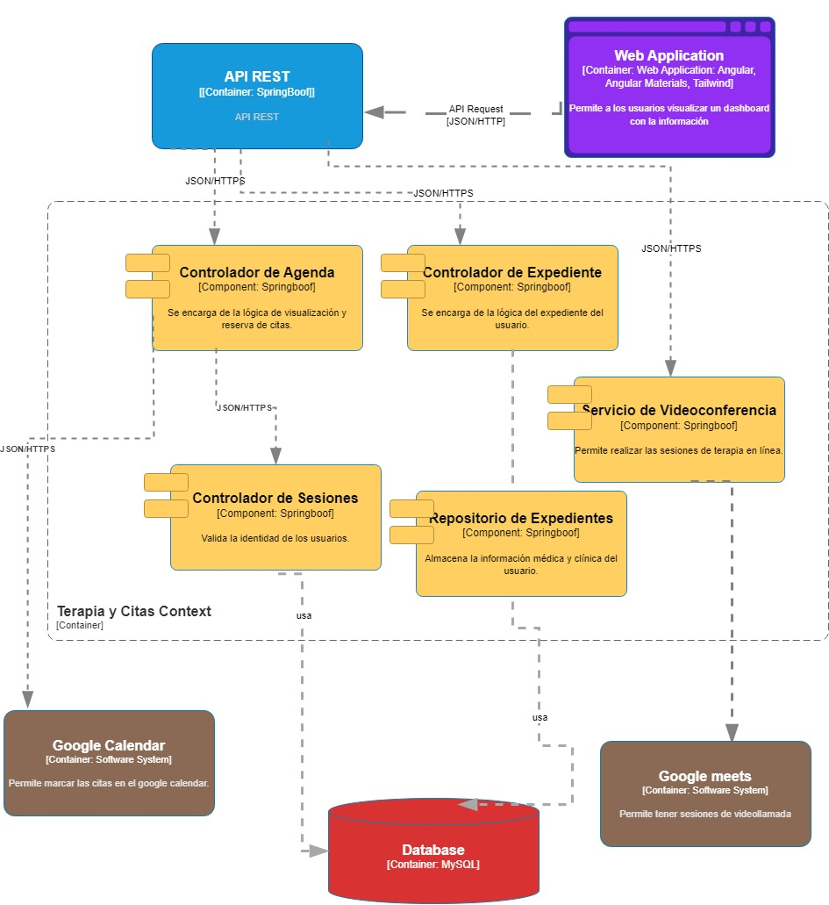

 <hr>

# <center>COURSE PROJECT</center>

<p align="center">
    <strong>Universidad Peruana de Ciencias Aplicadas</strong><br>
    </img><br>
    <strong>Ingeniería de Software</strong><br>
    <strong>Desarrollo de Aplicaciones Open Source - SW53</strong><br>
    <strong>Profesor: Elio Jefferson Navarrete Vilca </strong><br>
    <br>INFORME DEL TRABAJO FINAL
</p>

<center>

#### Startup: **XXXXXX**
#### Product: **XXXXXX**

</center>

# Team  Members:
<center>

| Member                           | Code       |
|----------------------------------|------------|
| Alexander Paolo Justo Yauricasa  | u20191c054 |
| Burga loarte Anaely Zarely       | u202118264 |
| Djalma Santos Dioses Molina      | u201921405 |
| Nicolas Sebastian Esteban Garcia | u202217485 |
| Johan Príncipe Godoy             | u202014511 |
| Torrejon Navarro Braulio Rodrigo         | u201711828 |
</center>

# Registro de Versiones del Informe

| Version | Fecha      | Autor   | Descripcion de Modificacion |
| ------- | ---------- | ------- | --------------------------- |
| 0.0     | 19/03/2024 | Grupo 1 | Se crea el documento        |

# Project Report Collaboration Insights

[URL del repositorio](https://www.example.com)

(Imagenes de los commits cada entrega)

# Contenido

[Registro de Versiones del Informe](#registro-de-versiones-del-informe)

[Project Report Collaboration Insights](#project-report-collaboration-insights)

[Student Outcome](#student-outcome)

[Capítulo I: Introducción](#capítulo-i-introducción)

[1.1 Startup Profile](#11-startup-profile)  
[1.1.1. Descripción de la Startup](#111-descripción-de-la-startup)  
[1.1.2. Perfiles de integrantes del equipo](#112-perfiles-de-integrantes-del-equipo)

[1.2. Solution Profile](#12-solution-profile)  
[1.2.1 Antecedentes y problemática](#121-antecedentes-y-problemática)  
[1.2.2 Lean UX Process.](#122-lean-ux-process)  
[1.2.2.1. Lean UX Problem Statements.](#1221-lean-ux-problem-statements)  
[1.2.2.2. Lean UX Assumptions.](#1222-lean-ux-assumptions)  
[1.2.2.3. Lean UX Hypothesis Statements.](#1223-lean-ux-hypothesis-statements)  
[1.2.2.4. Lean UX Canvas.](#1224-lean-ux-canvas)

[1.3. Segmentos objetivo.](#13-segmentos-objetivo)

[Capítulo II: Requirements Elicitation & Analysis](#capítulo-ii-requirements-elicitation--analysis)

[2.1. Competidores](#21-competidores)  
[2.1.1. Análisis competitivo]()  
[2.1.2. Estrategias y tácticas frente a competidores](#211-análisis-competitivo)

[2.2. Entrevistas](#22-entrevistas)  
[2.2.1. Diseño de entrevistas](#221-diseño-de-entrevistas)    
[2.2.3. Análisis de entrevistas](#223-análisis-de-entrevistas)

[2.3. Needfinding](#23-needfinding)  
[2.3.1. User Personas](#231-user-personas)  
[2.3.2. User Task Matrix](#232-user-task-matrix)  
[2.3.3. User Journey Mapping](#233-user-journey-mapping)  
[2.3.4. Empathy Mapping](#234-empathy-mapping)  
[2.3.5. As-is Scenario Mapping](#235-as-is-scenario-mapping)

[2.4. Ubiquitous Language](#24-ubiquitous-language)

[Capítulo III: Requirements Specificatio](#capítulo-iii-requirements-specification)

[3.1. To-Be Scenario Mapping](#31-to-be-scenario-mapping)

[3.2. User Stories](#32-user-stories)

[3.3. Impact Mapping](#33-impact-mapping)

[3.4. Product Backlog](#34-product-backlog)

[Capítulo IV: Product Desig](#capítulo-iv-product-design)

[4.1. Style Guidelines](#41-style-guidelines)  
[4.1.1. General Style Guidelines](#411-general-style-guidelines)  
[4.1.2. Web Style Guidelines](#412-web-style-guidelines)

[4.2. Information Architecture](#42-information-architecture)  
[4.2.1. Organization Systems](#421-organization-systems)  
[4.2.2. Labeling Systems](#422-labeling-systems)  
[4.2.3. SEO Tags and Meta Tag](#423-seo-tags-and-meta-tags)  
[4.2.4. Searching Systems](#424-searching-systems)   
[4.2.5. Navigation Systems](#425-navigation-systems)

[4.3. Landing Page UI Design](#43-landing-page-ui-design)   
[4.3.1. Landing Page Wireframe](#431-landing-page-wireframe)  
[4.3.2. Landing Page Mock-up](#432-landing-page-mock-up)

[4.4. Web Applications UX/UI Design](#44-web-applications-uxui-design)  
[4.4.1. Web Applications Wireframes](#441-web-applications-wireframes)  
[4.4.2. Web Applications Wireflow Diagrams](#442-web-applications-wireflow-diagrams)  
[4.4.2. Web Applications Mock-ups](#442-web-applications-mock-ups)   
[4.4.3. Web Applications User Flow Diagrams](#443-web-applications-user-flow-diagrams)

[4.5. Web Applications Prototyping](#45-web-applications-prototyping)

[4.6. Domain-Driven Software Architecture](#46-domain-driven-software-architecture)  
[4.6.1. Software Architecture Context Diagram](#461-software-architecture-context-diagram)  
[4.6.2. Software Architecture Container Diagrams](#462-software-architecture-container-diagrams)  
[4.6.3. Software Architecture Components Diagrams](#463-software-architecture-components-diagrams)

[4.7. Software Object-Oriented Design](#47-software-object-oriented-design)  
[4.7.1. Class Diagrams](#471-class-diagrams)  
[4.7.2. Class Dictionary](#472-class-dictionary)

[4.8. Database Design](#48-database-design)  
[4.8.1. Database Diagram](#481-database-diagram)

[Capítulo V: Product Implementation, Validation & Deploymen](#capítulo-v-product-implementation-validation--deployment)

[5.1. Software Configuration Management](#51-software-configuration-management)  
[5.1.1. Software Development Environment Configuration](#511-software-development-environment-configuration)  
[5.1.2. Source Code Management](#512-source-code-management)  
[5.1.3. Source Code Style Guide & Conventions](#513-source-code-style-guide--conventions)  
[5.1.4. Software Deployment Configuration](#514-software-deployment-configuration)

[5.2. Landing Page, Services & Applications Implementation](#52-landing-page-services--applications-implementation)  
[5.2.X. Sprint ](#52x-sprint-n)  
[5.2.X.1. Sprint Planning n](#52x1-sprint-planning-n)  
[5.2.X.2. Sprint Backlog n](#52x2-sprint-backlog-n)  
[5.2.X.3. Development Evidence for Sprint Review](#52x3-development-evidence-for-sprint-review)  
[5.2.X.4. Testing Suite Evidence for Sprint Review](#52x4-testing-suite-evidence-for-sprint-review)  
[5.2.X.5. Execution Evidence for Sprint Review](#52x5-execution-evidence-for-sprint-review)  
[5.2.X.6. Services Documentation Evidence for Sprint Review](#52x6-services-documentation-evidence-for-sprint-review)  
[5.2.X.7. Software Deployment Evidence for Sprint Review](#52x7-software-deployment-evidence-for-sprint-review)  
[5.2.X.8. Team Collaboration Insights during Sprint](#52x8-team-collaboration-insights-during-sprint)

[5.3. Validation Interviews](#53-validation-interviews)  
[5.3.1. Diseño de Entrevistas](#531-diseño-de-entrevistas)  
[5.3.2. Registro de Entrevistas](#532-registro-de-entrevistas)  
[5.3.3. Evaluaciones según heurísticas](#533-evaluaciones-según-heurísticas)

[5.4. Video About-the-Product](#54-video-about-the-product)

[Conclusiones](#conclusiones)

[Conclusiones y recomendaciones](#conclusiones-y-recomendaciones)

[Video About-the-Team](#video-about-the-team)

[Bibliografía](#bibliografía)

[Anexos](#anexos)

# Student Outcome

| Criterio Especifico                                                                                                                                  | Acciones Realizadas                                     | Conclusiones           |
| ---------------------------------------------------------------------------------------------------------------------------------------------------- | ------------------------------------------------------- | ---------------------- |
| Participa en equipos multidisciplinarios con eficacia, eficiencia y objetividad, en el marco de un proyecto en soluciones de ingeniería de software. | Compañero1:<br> *TB1:*  Su texto *TB2:* texto etc..     | Su texto de conclusion |
| Conoce al menos un sector empresarial o dominio de aplicación de soluciones de software.                                                             | Compañero1:<br> *TB1:*  Su texto<br> *TB2:* texto etc.. | Su texto de conclusion |

# Capítulo I: Introducción

## 1.1. Startup Profile

### 1.1.1. Descripción de la Startup

Nuestra startup [nombre] tiene como objetivo conectar a personas que presentan algún tipo de bienestar emocional, tales como estrés laboral, ansiedad social y necesitan ayuda de especialistas en salud mental. Si estás estresado, ansioso o tienes otros problemas similares, nuestra aplicación se encargará de ofrecer un espacio donde puedes expresar lo que te está pasando. Los usuarios pueden participar en pequeños foros donde pueden hablar sobre sus problemas y recibir recomendaciones y/o consejos acerca de ejercicios de relajación que pueden adoptar como rutina, los cuales son ofrecidos por especialistas en salud mental y también podrán participar de talleres y eventos gratuitos ofrecidos por especialistas. Además, ofrecemos un plan de suscripción que incluye acceso a eventos exclusivos, análisis detallados de tu salud emocional y la posibilidad de reservar hasta 3 citas con nuestros especialistas, que están disponibles en la aplicación. Se contará con acceso al perfil del especialista además de ver una sección de reseñas de usuarios beneficiados con sus terapias, con el fin de que puedan adquirir sus servicios. Este proyecto busca proporcionar a los usuarios afectados un espacio seguro para expresar sus preocupaciones y recibir apoyo de especialistas y otros usuarios dispuestos a ofrecer consejos y ayuda.

#### 1.1.2. Perfiles de integrantes del equipo
<!-- poner las rutas de las imagenes de assets en src -->
| Miembros del equipo                                                                                                                     | Codigo Estudiante | Carrera | Conocimientos / Habilidades                                                   |
|-----------------------------------------------------------------------------------------------------------------------------------------|-------------------|-|-------------------------------------------------------------------------------| 
| Nicolas Sebastian Esteban Garcia   | U202217485        |Ingenieria de software| C++, JS, HTML, CSS, Phyton. Comunicación asertiva y facil adaptación          |
| Djalma Santos Dioses Molina                                                    | U201921405        |Ingenieria de software| HTML, CSS, JS, C++, C#, SQL, Phyton. Responsable.                             |
| Esteban Garcia, Nicolas Sebastian                                              | U202217485        |Ingenieria de software| C++, JS, HTML, CSS, Phyton                                                    |
| Príncipe Godoy, Johan 	             | U202014511        |Ingenieria de software| C++, JS, HTML, CSS, Phyton, SQL, MongoDB. Trabajo en equipo y responsabilidad |
| Burga Loarte Anaely <br />	                                                          | U202118264        |Ingenieria de software| C++, C#, JS, HTML, CSS, Phyton | 
| Torrejon Navarro Braulio Rodrigo	                                                          | U201711828        |Ingenieria de software| C++, C#, JS, HTML, CSS, Phyton | 
| Alexander Paolo Justo Yauricasa                                                 | U201921405        |Ingenieria de software| Phyton, HTML, JS, C++, C#, SQL. Facil adaptación y responsable                   |

## 1.2. Solution Profile

### 1.2.1 Antecedentes y problemática

Durante el año 2023, se realizó una investigación exhaustiva sobre los índices de salud mental, evidenciando una compleja interacción de factores que afectan el bienestar emocional de la población. Estudios como el llevado a cabo por Johnson et al. (2023) subrayaron la importancia de considerar no solo las diferencias de género, sino también otros aspectos como la edad, el entorno socioeconómico y la historia de trauma en la manifestación de trastornos emocionales. Se encontró que las mujeres tenían una mayor prevalencia de trastornos de ansiedad y depresión, lo que se asociaba con factores como la carga de responsabilidades familiares y sociales, así como el estrés crónico. Por otro lado, los hombres mostraban una mayor propensión hacia trastornos relacionados con la ira y la impulsividad, aunque estas tendencias podrían estar influenciadas por normas de género y roles sociales preestablecidos.

Además, investigaciones como el Informe Global sobre la Salud Mental (2023) destacaron la importancia de abordar los determinantes sociales de la salud mental, como la discriminación, la marginalización y la falta de acceso a recursos básicos. Estos factores, junto con la estigmatización asociada a los trastornos emocionales, representan barreras significativas para la búsqueda de ayuda y tratamiento. En consecuencia, se requieren intervenciones integrales que no solo se centren en el diagnóstico y tratamiento clínico, sino también en la promoción de entornos sociales y comunitarios que fomenten el apoyo mutuo, la inclusión y la resiliencia emocional.

Investigacion (5w, 2h tbn)

### 1.2.2 Lean UX Process.

#### 1.2.2.1. Lean UX Problem Statements.

Texto

#### 1.2.2.2. Lean UX Assumptions.

| Business Assumptions | User Assumptions |
| -------------------- | ---------------- |
| 1. - 12.             | 1. - 6.          |

#### 1.2.2.3. Lean UX Hypothesis Statements.

Texto

#### 1.2.2.4. Lean UX Canvas.

(imagen con texto)

## 1.3. Segmentos objetivo.

|                           | Segmento 1 | Segmento 2 |
| ------------------------- | ---------- | ---------- |
| Variables                 |            |            |
| Geográfica                |            |            |
| Demográfica               |            |            |
| Psicológica               |            |            |
| Función de comportamiento |            |            |

---

# Capítulo II: Requirements Elicitation & Analysis

## 2.1. Competidores.

### 2.1.1. Análisis competitivo.

| Competitive Analysis Landscape        |     |
| ------------------------------------- | --- |
| ¿Por qué llevar a cabo este análisis? | --  |

|                     |                                                       | (Nosotros)                                                                                                                     | Competidor                                                                  | Comptdor                                             |
| ------------------- | ----------------------------------------------------- | ------------------------------------------------------------------------------------------------------------------------------ | --------------------------------------------------------------------------- | ---------------------------------------------------- |
| PERFIL              | Overview                                              | lorem                                                                                                                          | ipsum                                                                       | lorem                                                |
|                     | Ventaja competitiva ¿Qué valor ofrece a los clientes? | ipsu                                                                                                                           | impuz                                                                       |
|                     | Mercado Objetivo                                      | Jeda                                                                                                                           | asa                                                                         | asa2                                                 |
| Perfil de marketing | Estrategia de Marketing                               | Redes Sociales                                                                                                                 | Redes Sociales                                                              | Televisión, Redes Sociales                           |
| Perfil del producto | Productos y servicios                                 | Elementos Gráficos Interactivos Enseñanza de Matemáticas Lúdica y Autodidacta Educación matemática interactiva Ámbito Freemium | Educación matemática interactiva Mas de 100 cursos en 28 idiomas diferentes | Educación general interactiva Contratos con Movistar |
|                     | Precios y costos                                      | Freemium (Cuenta Premium permite personalizar los juegos) Gratis                                                               | Gratuito                                                                    | Gratuito                                             |
|                     | Canales de distribución (Web y/o Móvil)               | Web y Móvil Web                                                                                                                | Móvil Web                                                                   | Web y móvil Web                                      |

### 2.1.2. Estrategias y tácticas frente a competidores.

| Competidores -> |               | Nosotros | Competidor2 | Competidor3 |
| --------------- | ------------- | -------- | ----------- | ----------- |
| Análisis SWOT   | Fortalezas    | lorem    | Lorem       | lorem       |
|                 | Debilidades   | lorem    | lorem       | lorem       | lorem |
|                 | Oportunidades | lorem    | lorem       | lorem       | lorem |
|                 | Amenazas      | lorem    | lorem       | lorem       | lorem |

## 2.2. Entrevistas.

### 2.2.1. Diseño de entrevistas.

**Preguntas generales:**

1. ¿Cuál es su nombre?
2. ¿Qué edad tiene?
3. ¿A qué se dedica?
4. ¿[Opinion de idea de propuesta]?

**Entrevistas usuario segmento 2**

1. ¿Lorem?
2. ¿Lorem?
3. ¿Lorem?
4. ¿Lorem?

**Entrevistas usuario segmento 2**

1. ¿Lorem?
2. ¿Lorem?
3. ¿Lorem?
4. ¿Lorem?

### 2.2.2. Registro de entrevistas.

**Segmento 1**  
Nombre: _____
Edad: _ años
Ocupación: _____  
  
{texto mucho}

**Segmento 2**  
Nombre: _____
Edad: _ años
Ocupación: _____  

{texto}

### 2.2.3. Análisis de entrevistas.

**Segmento 1:**
{texto}
**Segmento 2:**
{texto}

## 2.3. Needfinding.

### 2.3.1. User Personas.

**Segmento 1:**  


**Segmento 2:**


### 2.3.2. User Task Matrix.

| ---  | ------  | Segmento 1  | ------/----- | Segmento 2  | ---------- |
| ---- | ------- | ----------- | ------------ | ----------- | ---------- |
| ID   | Titulo  | Importancia | Frecuencia   | Importancia | Frecuencia |
| U01X | {Texto} | Alta        | Alta         | Media       | Baja       |

### 2.3.3. User Journey Mapping.

**Registration:**
Why would they trust us?

- s
- s
- s

**Onboarding and first use:**
How can they feel successful?

- s
- s
- s

**Sharing:**
Why would they invite others?

- s
- s
- s

### 2.3.4. Empathy Mapping.

**Segmento 1:**


**Segmento 2:**


### 2.3.5. As-is Scenario Mapping.

**Segmento 1**  
Escenario: {escenario}

As Is:
| Fases    | Fase 1 | Fase 2 | Fase 3 | Fase 4 |
| -------- | ------ | ------ | ------ | ------ |
| Doing    | texto  | texto  | texto  | texto  |
| Thinking | texto  | texto  | texto  | texto  |
| Feeling  | texto  | texto  | texto  | texto  |

**Segmento 2**  
Escenario: Dificultad para entender Matemáticas

As Is:
| Fases    | Fase 1 | Fase 2 | Fase 3 | Fase 4 |
| -------- | ------ | ------ | ------ | ------ |
| Doing    | texto  | texto  | texto  | texto  |
| Thinking | texto  | texto  | texto  | texto  |
| Feeling  | texto  | texto  | texto  | texto  |

## 2.4. Ubiquitous Language.

```
Texto ubiquo: Definicion de este
```

---

# Capítulo III: Requirements Specification

## 3.1. To-Be Scenario Mapping.

Segmento 1:

| Fases    | fase 1 as is | fase 2 | fase 3 |
| -------- | ------------ | ------ | ------ |
| Doing    |              | texto  | texto  | texto | texto |
| Thinking |              | texto  | texto  | texto | texto |
| Feeling  |              | texto  | texto  | texto | texto |

Segmento 2:
| Fases    | fase 1 as is | fase 2 | fase 3 |
| -------- | ------------ | ------ | ------ |
| Doing    |              | texto  | texto  | texto | texto |
| Thinking |              | texto  | texto  | texto | texto |
| Feeling  |              | texto  | texto  | texto | texto |

## 3.2. User Stories.

| HU0X | Historia Usuario | "Descripcion" |
| ---- | ---------------- | ------------- |

## 3.3. Impact Mapping.


## 3.4. Product Backlog.

| #Orden | User Story ID | Titulo     | Descripción | Story Points (1/2/3/5/8) |
| ------ | ------------- | ---------- | ----------- | ------------------------ |
| 1      | HU01          | titulo his | desc        | 5                        |

# Capítulo IV: Product Design

## 4.1. Style Guidelines.

### 4.1.1. General Style Guidelines.

Como empresa emergente, nuestra meta es asegurar que la interfaz de nuestra aplicación [name] transmita un sentido de profesionalismo, facilidad de uso y precisión para nuestros usuarios. Nos esforzamos en garantizar que los usuarios puedan llevar a cabo sus proyectos de manera eficaz, por lo que empleamos recursos visuales para atraer a nuestros segmento objetivo. Optamos por colores asociados al ámbito de la salud mental y utilizamos una tipografía con diferentes tamaños que garantiza la legibilidad.

**Color:** 
| Color | Descripcion | Muestra |
| ----- | ----------- | ------- |
| Color Primario | Celeste, usaremos este color ya que se asocia con el cielo despejado y el agua serena, ademas evoca una sensación de calma y serenidad |   |
| Color Segundario | Blanco, usaremos este color ya que es un color clásico y atemporal que también puede crear entornos tranquilos y serenos. Al combinar el blanco con otros tonos suaves se puede crear un ambiente aún más relajante y acogedor. |   |


**Tipografia:** 
| Tipografia | Fuente | Muestra |
| ---------- | ------ | ------- |
| Tipografia Principal | Fuente: Open Runde / Tamaño: 25 px - 55 px |  |
| Tipografia Segundario | Fuente: Arima / Tamño: 12 px - 20 px |  |


**Brand Overview:** 

Nuestra porpuesta suerge por la falta de recursos de ayuda en la salud mental, por lo que brindamos una solución tecnológica en la cual podrán encontrar un repertorio de ayuda psicologuica que necesiten por especialistas en el tema.   

**Brand Name:**


### 4.1.2. Web Style Guidelines.

Nuestra página de inicio utiliza el Patrón minimalista en su diseño, que está pensado para orientar al usuario de manera fluida y eficiente a través de la página. En la parte superior, se presenta una barra de navegación con un tono oscuro, que transmite una sensación de seriedad y confianza. Esta barra incluye el logotipo y enlaces a secciones como "Inicio", "Servicios", "Acerca de nosotros", "Testimonios" y "Descargar". Se ha optado por una paleta de colores basada en tonos verdes, que reflejan el sector agrícola al que nos dedicamos en nuestra startup. Estos colores contrastan con el resto de la página, destacando así la invitación al usuario para descargar y probar nuestra aplicación.


## 4.2. Information Architecture.

En el proyecto "CalmConnection", la arquitectura de la información se diseña meticulosamente para garantizar una experiencia de usuario coherente y efectiva. Esta arquitectura se fundamenta en la comprensión profunda de las necesidades emocionales de los usuarios y las soluciones propuestas para abordarlas. A continuación, se detallan y se amplían los sistemas de arquitectura de información seleccionados:

### 4.2.1. Organization Systems.

En la creación del Lading Page y también de la aplicación web haremos uso del enfoque jerárquica. Esta metodología permitirá asignar la ubicación óptima a cada elemento requerido en el desarrollo y este enfoque jerárquico permite una navegación clara y fácil, lo que ayuda a los usuarios a encontrar rápidamente lo que están buscando y a comprender la estructura general de la aplicación. Para lograrlo, se tendrán en cuenta factores como etiquetas, especificaciones de pantalla y resolución. Asimismo, se diseñarán íconos utilizando una matriz, lo que facilitará la visualización de los detalles y contribuirá a mantener un proceso ordenado en todo momento.

- Selección: Jerárquico: El sistema de organización jerárquica se adapta perfectamente a las necesidades de "CalmConnection". Este enfoque estructura el contenido en un formato que refleja la importancia y la relación de los elementos entre sí. Por ejemplo, la página de inicio actúa como un punto central desde el cual los usuarios pueden acceder a los servicios principales, como los foros de discusión, eventos y opciones de suscripción. Desde allí, pueden navegar hacia abajo a través de niveles de contenido secundario para encontrar información más específica o detallada sobre temas relacionados con su bienestar emocional.

- Matrix: Si bien el enfoque de matriz permite una flexibilidad en la navegación, podría resultar abrumador para los usuarios debido a la cantidad de opciones disponibles. La organización jerárquica proporciona una estructura más clara y fácil de entender para los usuarios, lo que mejora la usabilidad y la experiencia general. Si bien no se aplicará ampliamente, el enfoque matricial se utilizará en áreas donde los usuarios puedan beneficiarse de la flexibilidad de elegir cómo desean explorar el contenido. Por ejemplo, podríamos permitir a los usuarios ordenar las publicaciones del foro por temas, fecha o popularidad, brindándoles opciones para personalizar su experiencia de navegación según sus preferencias individuales y se incluirá para que cuando el usuario quisiera consigurar aspectos de la cuenta creada pueda realizar los cambios necesario en apartados divididos.
  
- Sequential: Aunque este enfoque puede ser útil para guiar a los usuarios a través de un proceso paso a paso, no se adapta bien a la naturaleza diversa y multifacética de "CalmConnection". La organización jerárquica permite una exploración más libre y personalizada de los servicios y recursos disponibles. Sin embargo, se incluirá al momento de que los usuarios realicen la creación de sus cuenta o realicen el plan de suscripción que se ofrecerá en la aplicación.

- Esquemas de Categorización de Contenido:
Por Tópicos: La categorización por temas será fundamental en áreas como los foros de discusión y la biblioteca de recursos. Los usuarios podrán explorar y participar en discusiones sobre temas específicos relacionados con su bienestar emocional, como manejo del estrés, ansiedad social, técnicas de relajación, entre otros.

Según Audiencia:Se aplicará una categorización basada en secciones como el perfil del especialista y los eventos. Los usuarios podrán buscar y filtrar especialistas según sus áreas de especialización y experiencia, lo que les permitirá encontrar el apoyo más relevante para sus necesidades emocionales específicas.


### 4.2.2. Labeling Systems.

En "CalmConnection", hemos dedicado especial atención a seleccionar etiquetas descriptivas que guíen de manera clara y efectiva a nuestros usuarios a través de la aplicación. Cada etiqueta ha sido cuidadosamente elegida para reflejar con precisión el propósito y el contenido de las diversas secciones de nuestra plataforma, asegurando una experiencia de navegación fluida y satisfactoria.

- Inicio: La etiqueta "Inicio" actúa como la puerta de entrada a nuestra aplicación, ofreciendo a los usuarios una visión general de los servicios y recursos disponibles en "CalmConnection". Desde aquí, los usuarios pueden iniciar su viaje hacia el bienestar emocional explorando las diversas opciones y funcionalidades que ofrecemos.

- Servicios: Al seleccionar esta etiqueta, nuestros usuarios son conducidos a una sección que resalta los principales servicios ofrecidos por "CalmConnection". Desde foros de discusión hasta eventos especiales y opciones de suscripción, esta sección proporciona una descripción detallada de los recursos disponibles para nuestros usuarios.

- Quiénes Somos: La etiqueta "Quiénes Somos" les brinda a nuestros usuarios la oportunidad de conocer más sobre la historia y el equipo detrás de "CalmConnection". Aquí, compartimos nuestra misión, visión y valores, así como también presentamos al equipo comprometido con el desarrollo y mantenimiento de nuestra aplicación.

- Ayuda: En "CalmConnection", nos esforzamos por ofrecer apoyo y orientación a nuestros usuarios en cada paso del camino. La etiqueta "Ayuda" les proporciona acceso a recursos y guías diseñadas para resolver cualquier duda o problema que puedan encontrar durante su experiencia con nuestra aplicación.

- Preguntas: Nuestra sección de "Preguntas" ofrece respuestas a las consultas más comunes sobre el funcionamiento y los servicios de "CalmConnection". Desde detalles sobre la reserva de citas hasta información sobre eventos futuros, esta sección sirve como una valiosa fuente de información para nuestros usuarios.

- Testimonios: ¿Qué mejor manera de conocer los beneficios de "CalmConnection" que a través de las experiencias reales de nuestros usuarios? La etiqueta "Testimonios" presenta historias auténticas y reseñas de aquellos que han encontrado apoyo y soluciones a través de nuestra plataforma.

- Descargar: La etiqueta "Descargar" ofrece a nuestros usuarios un acceso rápido y conveniente para obtener la aplicación "CalmConnection" en sus dispositivos preferidos. Con enlaces directos a las diferentes versiones disponibles, facilitamos que nuestros usuarios comiencen a disfrutar de los beneficios de nuestra aplicación en cualquier momento y lugar.

Con estas etiquetas descriptivas, buscamos garantizar que la experiencia de navegación en "CalmConnection" sea clara, intuitiva y completamente centrada en las necesidades de nuestros usuarios.

### 4.2.3. SEO Tags and Meta Tags

Las etiquetas de SEO y metaetiquetas desempeñan un papel crucial en la visibilidad y la accesibilidad de "CalmConnection" en los motores de búsqueda. Las etiquetas SEO consisten en términos clave pertinentes y descripciones breves, con el propósito de que los motores de búsqueda puedan indexar y clasificar eficazmente el contenido de la aplicación. Por otro lado, las metaetiquetas ofrecen detalles adicionales acerca de la página, como el título y la descripción que se visualizan en los resultados de búsqueda. Estas etiquetas son esenciales para aumentar la visibilidad y la clasificación de "CalmConnection" en los motores de búsqueda, lo que resulta en un mayor tráfico y una mayor exposición para la aplicación.

- Landing Page:

Tittle: CalmConnection.<br>
Description: CalmConnection - CalmConnection Official Landing Page.<br>
Keywords: emotional, connection, mental health, psychologists.<br>
Authors: CalmConnection team.<br>

- Aplicación web:

Tittle: CalmConnection.<br>
Description: CalmConnection - CalmConnection Official Web Page <br>
Keywords: emotional, connection, mental health, psychologists.<br>
Authors: CalmConnection team.<br>

### 4.2.4. Searching Systems.

Dentro de "CalmConnection" hemos diseñado un sistema de búsqueda que permite a nuestros usuarios encontrar rápida y eficientemente información relevante para mejorar su bienestar emocional.

**¿Qué se busca?**
Nuestros usuarios tienen la posibilidad de explorar una amplia variedad de temas relacionados con su salud mental y emocional. Desde técnicas para manejar el estrés hasta estrategias para abordar la ansiedad social, nuestro sistema de búsqueda abarca una amplia gama de necesidades.

**¿Qué resultados se mostrarán?**
Al realizar una búsqueda, los usuarios encontrarán una lista diversa de resultados que cubren diferentes aspectos de su consulta. Esto incluye publicaciones significativas de nuestros foros de discusión, próximos eventos relacionados con el tema, talleres disponibles que pueden ofrecer herramientas adicionales, y perfiles detallados de especialistas en salud mental que pueden proporcionar orientación y apoyo personalizado.

**Interfaz de Búsqueda:**
La interfaz de búsqueda ha sido diseñada pensando en la facilidad de uso y la accesibilidad. Los usuarios pueden escribir sus consultas en un cuadro de búsqueda dedicado, y nuestra función de autocompletar les ofrece sugerencias relevantes para agilizar el proceso. Una vez realizada la búsqueda, los resultados se presentan de manera clara y ordenada, con opciones de filtrado y clasificación disponibles para una navegación más eficiente y personalizada.

Con nuestro sistema de búsqueda, garantizamos que los usuarios de "CalmConnection" puedan acceder de manera rápida y sencilla a recursos que promuevan su bienestar emocional, brindándoles el apoyo necesario para afrontar sus desafíos emocionales con confianza y seguridad.


### 4.2.5. Navigation Systems.
En "CalmConnection", nos esforzamos por asegurar que la navegación dentro de nuestra aplicación de salud mental sea intuitiva y efectiva, ofreciendo a los usuarios una experiencia enriquecedora y satisfactoria mientras buscan apoyo y recursos para fortalecer su bienestar emocional.

- Sistema de Navegación Jerárquica:
Hemos adoptado una estructura jerárquica en nuestra plataforma para facilitar a los usuarios el acceso a diversas áreas diseñadas para abordar sus necesidades emocionales. Desde la página de inicio, los usuarios pueden explorar los foros de discusión para conectarse con otros usuarios, acceder a eventos y talleres organizados por especialistas en salud mental, y explorar perfiles de expertos para programar citas y obtener asesoramiento personalizado. Esta jerarquía claramente definida les permite a los usuarios encontrar rápidamente los recursos y el apoyo que están buscando, guiándolos de manera lógica a través de la aplicación.

- Sistema de Navegación Global:
Nuestra aplicación cuenta con un sistema de navegación global que permite a los usuarios moverse sin problemas entre las distintas secciones y regresar a la página de inicio en cualquier momento. Esta coherencia en la navegación brinda a los usuarios una sensación de familiaridad y control mientras exploran las diferentes características y servicios disponibles en "CalmConnection". Este sistema se complementa con el movimiento vertical, permitiendo a los usuarios desplazarse por la página con facilidad utilizando la barra de navegación, lo que garantiza que siempre puedan regresar a la página principal con un solo clic.

- Sistema de Navegación Local:
Además del sistema global, ofrecemos un sistema de navegación local que permite a los usuarios acceder a páginas específicas dentro de la aplicación, como perfiles de especialistas o eventos específicos. Este sistema de navegación local actúa como un complemento al sistema global, permitiendo a los usuarios explorar contenido relacionado de manera intuitiva y acceder a información detallada según sus necesidades específicas.

Con estos sistemas de navegación, proporcionamos a los usuarios de "CalmConnection" una guía clara y efectiva a través de nuestra aplicación, facilitándoles el acceso a recursos y apoyo para mejorar su bienestar emocional y promover una vida más saludable y equilibrada.

## 4.3. Landing Page UI Design.

### 4.3.1. Landing Page Wireframe.

la pagina donde te registras y ves info del web app (te manda al web app)

Wireframe es todo lo funcional de la pagina


### 4.3.2. Landing Page Mock-up.

Mockup es todo lo relacionado al diseño de la pagina


## 4.4. Web Applications UX/UI Design.

### 4.4.1. Web Applications Wireframes.

lo funcional de cada aspecto del wireframe


### 4.4.2. Web Applications Wireflow Diagrams.

Wireflow es como se va a navegar por la pagina (boton me lleva a esta pagina y este me regresa)


### 4.4.2. Web Applications Mock-ups.

Diseño en todo aspecto


### 4.4.3. Web Applications User Flow Diagrams.

un flow diagram de como el usuario utilizara la pagina **[PARA CADA USER GOAL]**


## 4.5. Web Applications Prototyping.

[URL del Prototipo (Hecho en figma)](https://www.example.com)

## 4.6. Domain-Driven Software Architecture.

### 4.6.1. Software Architecture Context Diagram.


2. Bounded Context Map: Muestra la relacion entre bounded contexts (los bounded context son como una burbuja que
   encapsula palabras clave en los procesos para poder
   diferenciarlos [Ej. Bounded context enfocado en las ventas(ventas), otro en revisar el stock(gestion) y otro enfocado en los proveedores (suministros)])
   Se hace como un brainstorm y se ve en que pueden conectarse o
   comunicarse [se usa un circulo entre conexiones lineales (upstream o downstream) para definir comunicacion, algunos context se pueden integrar para representar por ejemplo un share model por database, tambien se mencionan los (third party context para definir los restful apis)]

### 4.6.2. Software Architecture Container Diagrams.


### 4.6.3. Software Architecture Components Diagrams.

1. Component diagrams: Estos van a mostrar las ordenes, procesos, mensajes y componentes utilizados en el uso del
   aplicativo, claro se deben hacer diferentes de estos para cada bounded o USER GOALS

   **Gestión del usuario Context Component Diagram:**


**Terapias y citas Context Component Diagram:**



**Comunidad y foro Context Component Diagram:**


## 4.7. Software Object-Oriented Design.

### 4.7.1. Class Diagrams.


### 4.7.2. Class Dictionary.

**User:**
La clase User representa a los usuarios regulares del sistema. Estos usuarios pueden buscar ayuda emocional, participar en eventos, interactuar en comunidades y reservar citas con especialistas. Pueden unirse a comunidades para conectarse con otros usuarios, compartir experiencias y buscar apoyo mutuo en temas relacionados con la salud mental.

**Specialist:**
La clase Specialist representa a los profesionales de la salud mental que ofrecen sus servicios en la plataforma. Estos especialistas pueden iniciar sesión en el sistema, listar los eventos que organizan, ver las citas programadas con sus pacientes y acceder a los perfiles de los pacientes. Además, pueden participar en comunidades para brindar apoyo y asesoramiento a los usuarios regulares en temas relacionados con la salud mental.

**Community:**
La clase Comunidad representa grupos de usuarios que se reúnen en la plataforma para discutir temas relacionados con la salud mental, compartir experiencias y brindarse apoyo mutuo. Los usuarios regulares pueden unirse a estas comunidades para conectarse con otros usuarios, buscar apoyo emocional y participar en discusiones grupales. Los especialistas también pueden participar en comunidades para ofrecer asesoramiento y orientación a los usuarios en busca de ayuda.

**Event:**
La clase Event representa eventos organizados en la plataforma, que pueden incluir talleres, charlas, sesiones de terapia grupales, etc. Los eventos pueden ser creados tanto por usuarios especialistas como por administradores del sistema. Pueden tener una variedad de atributos como nombre, fecha, ubicación y tipo. Los usuarios pueden asistir a estos eventos para obtener información, participar en actividades grupales y recibir apoyo de especialistas y otros participantes.

**Thread:**
La clase Thread representa una conversación o tema de discusión dentro de una comunidad. Cada hilo puede contener mensajes o respuestas de usuarios y puede estar relacionado con un tema específico relacionado con la salud mental. Los usuarios pueden crear nuevos hilos, responder a hilos existentes y participar en discusiones dentro de la comunidad.

**Date:**
La clase Date representa fechas disponibles para citas con especialistas. Estas fechas pueden ser definidas por los especialistas como horarios disponibles para atender a sus pacientes. Los usuarios pueden seleccionar estas fechas para reservar citas.

**Calendar:**
La clase Calendar está asociada a un especialista y almacena las fechas disponibles para citas. Cada calendario puede contener múltiples fechas disponibles para citas con el especialista. Los usuarios pueden acceder al calendario del especialista para reservar citas en los horarios disponibles.

**Quote:**
La clase Quote representa una cita programada entre un usuario y un especialista en una fecha específica. Al reservar una cita, se crea una instancia de esta clase que incluye la información de la fecha y hora de la cita, así como los detalles del usuario y el especialista involucrados.

**Category:**
La clase Category representa las categorías a las que pueden pertenecer eventos o comunidades en la plataforma. Cada evento o comunidad puede estar asociado a una o más categorías para facilitar la búsqueda y la organización. Las categorías pueden incluir temas como "Salud Mental", "Autoayuda", "Psicología Infantil", etc.

**Subscription:**
La clase Subscription representa una suscripción pagada ofrecida en la plataforma. Contiene información sobre el nombre de la suscripción, una descripción de los servicios incluidos, la duración de la suscripción y el precio asociado. Los usuarios pueden adquirir suscripciones para acceder a funciones premium o contenido exclusivo.

**User Subscription:**
La clase User Subscription representa la suscripción de un usuario a un plan de suscripción específico. Al adquirir una suscripción, se crea una instancia de esta clase que incluye información sobre el usuario que adquirió la suscripción, el tipo de suscripción, la fecha de inicio y la fecha de finalización de la suscripción.

**EventType:**
La clase EventType define los tipos de eventos que pueden ocurrir en la plataforma. Cada tipo de evento tiene un nombre descriptivo y una breve descripción que indica cómo se llevará a cabo el evento. Por ejemplo, puede haber eventos presenciales, eventos en línea (streaming), talleres virtuales, sesiones grupales, entre otros. Estos tipos de eventos ayudan a los usuarios a comprender mejor la naturaleza y el formato de cada evento ofrecido en la plataforma.


## 4.8. Database Design.

### 4.8.1. Database Diagram.


# Capítulo V: Product Implementation, Validation & Deployment

## 5.1. Software Configuration Management.

### 5.1.1. Software Development Environment Configuration.

Especificaciones de donde vamos a hacer el proyecto (vscode supongo)
extensiones tmbn? nose bn q quieren aca

### 5.1.2. Source Code Management.

El gitjab donde tengamos el proyecto

### 5.1.3. Source Code Style Guide & Conventions.

Que usamos con css (en caso usemos software para SASS)
supongo q tmbn cositas de como hacemo el code capas algun tipo de codigo para comunicarse entre comments

### 5.1.4. Software Deployment Configuration.

Configuraciones de donde y como deployeamos el proyecto

## 5.2. Landing Page, Services & Applications Implementation.

### 5.2.X. Sprint n

#### 5.2.X.1. Sprint Planning n.

Explicar como vamos a plannear el sprint?

#### 5.2.X.2. Sprint Backlog n.

 Nica hago la tabla

#### 5.2.X.3. Development Evidence for Sprint Review.


#### 5.2.X.4. Testing Suite Evidence for Sprint Review.


#### 5.2.X.5. Execution Evidence for Sprint Review.


#### 5.2.X.6. Services Documentation Evidence for Sprint Review.


#### 5.2.X.7. Software Deployment Evidence for Sprint Review.


#### 5.2.X.8. Team Collaboration Insights during Sprint.

 imagenes de colaboraciones github

## 5.3. Validation Interviews.

### 5.3.1. Diseño de Entrevistas.

**Preguntas generales:**

1. ¿Cuál es su nombre?
2. ¿Qué edad tiene?
3. ¿A qué se dedica?
4. ¿[Opinion de idea de propuesta]?

**Entrevistas usuario segmento 2**

1. ¿Lorem?
2. ¿Lorem?
3. ¿Lorem?
4. ¿Lorem?

**Entrevistas usuario segmento 2**

1. ¿Lorem?
2. ¿Lorem?
3. ¿Lorem?
4. ¿Lorem?

### 5.3.2. Registro de Entrevistas.

**Segmento 1**  
Nombre: _____
Edad: _ años
Ocupación: _____  
  
{texto mucho}

**Segmento 2**  
Nombre: _____
Edad: _ años
Ocupación: _____  

{texto}

### 5.3.3. Evaluaciones según heurísticas.

| HEURÍSTICA                                    | EVALUACIÓN ✅❌ | NOTA    |
| --------------------------------------------- | ------------- | ------- |
| Visibilidad del estado del sistema            |               | {texto} |
| Coincidencia entre el sistema y el mundo real |               | {texto} |
| Control y libertad del usuario                |               | {texto} |
| Consistencia y estándares                     |               | {texto} |
| Prevención de errores                         |               | {texto} |
| Mostrar antes que recordar                    |               | {texto} |
| Flexibilidad y eficiencia de uso              |               | {texto} |
| Diseño estético y minimalista                 |               | {texto} |
| Comunicar errores con facilidad               |               | {texto} |
| Ayuda y documentación                         |               | {texto} |

## 5.4. Video About-the-Product.

[URL del video about the product](https://www.example.com)

# Conclusiones

{texto}

# Conclusiones y recomendaciones.

{texto}

# Video About-the-Team.

[URL del video about the team](https://www.example.com)

# Bibliografía

``` 
formato

"Apellido", Ini.Ciales. & "otroAutor", O.A. (año). titulo del articulo.
        "nombre del articulo o lo q sea, Volumen(si es que tiene), numero  de pagina"#-#. https//link.org/eeeseneko

```

# Anexos

datos, gráficos, imágenes, esquemas, mapas o referencias de otros autores


