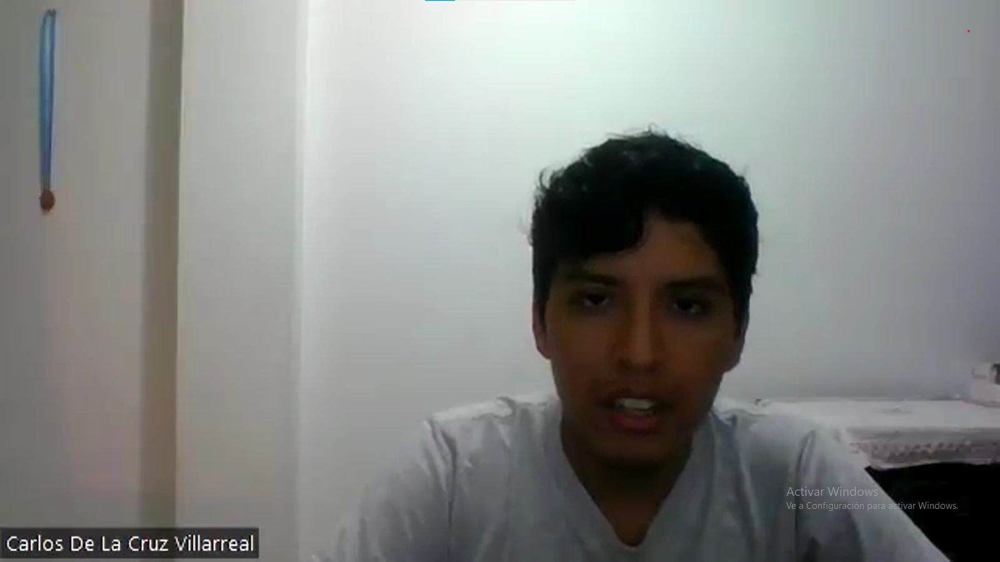
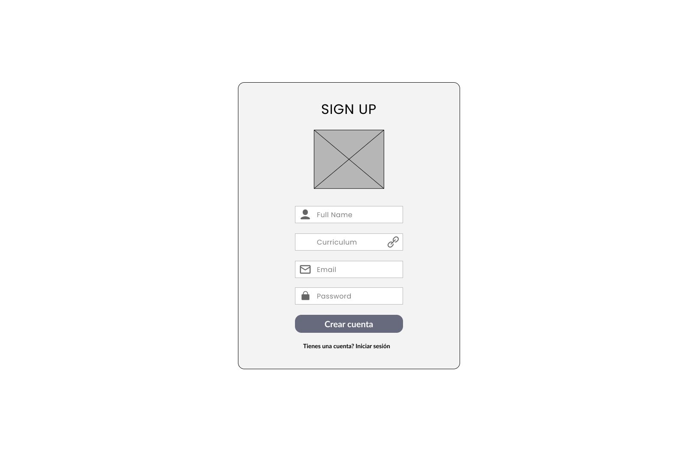
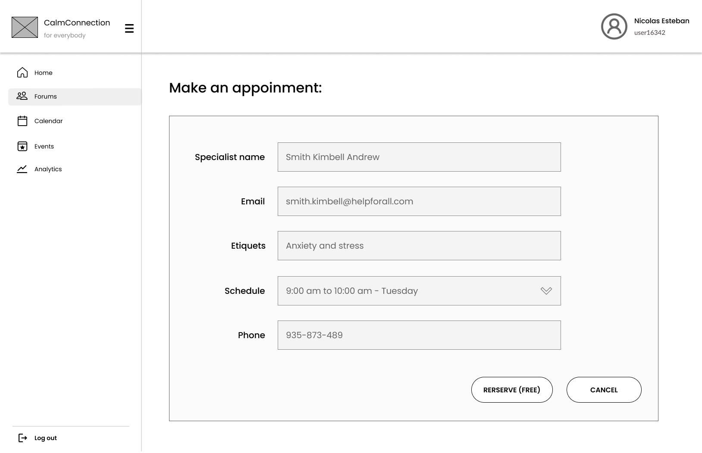
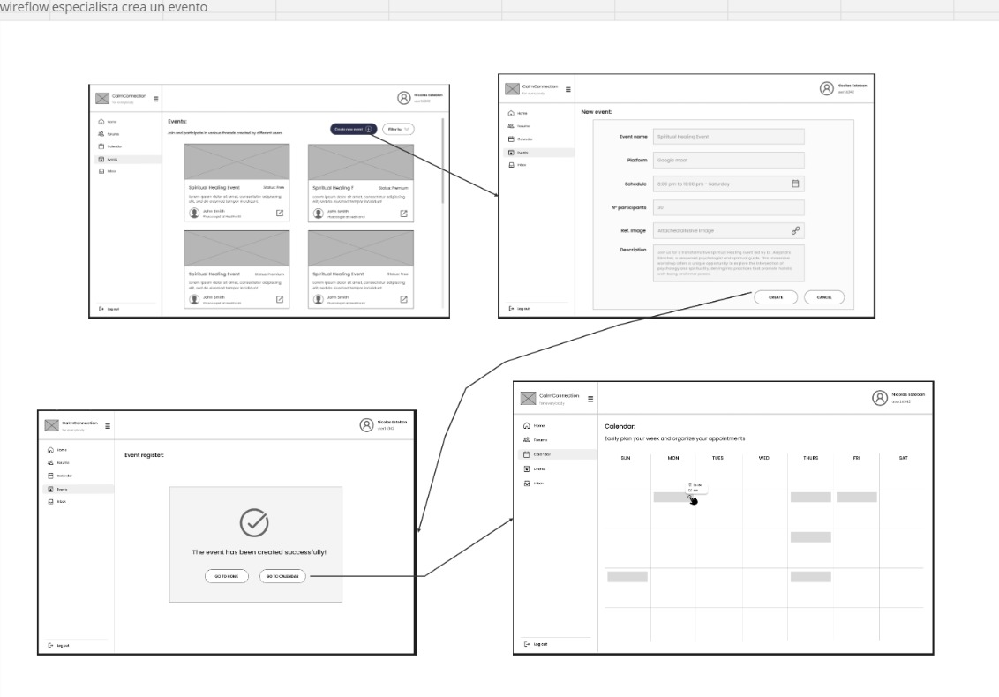
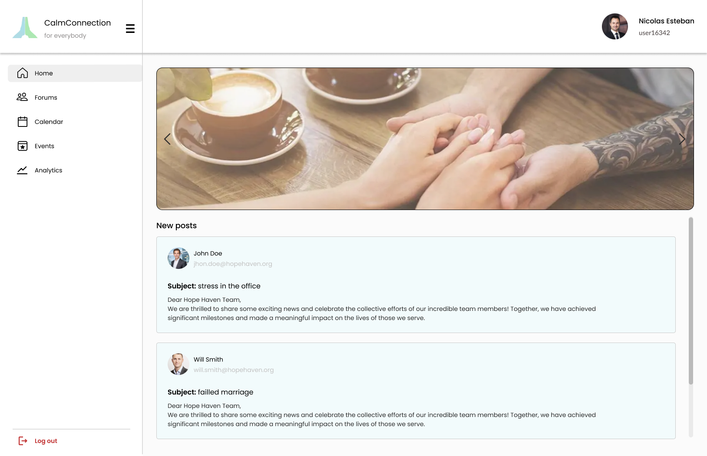
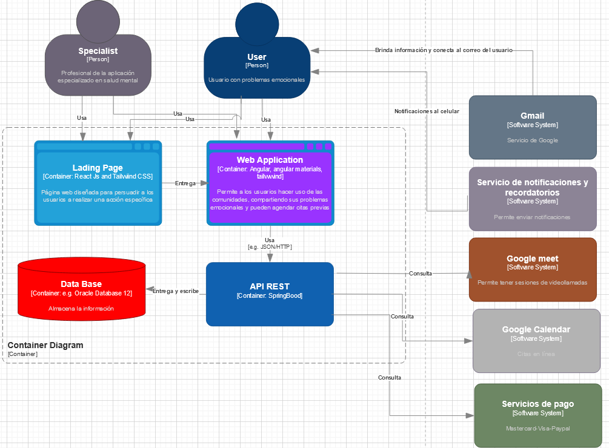
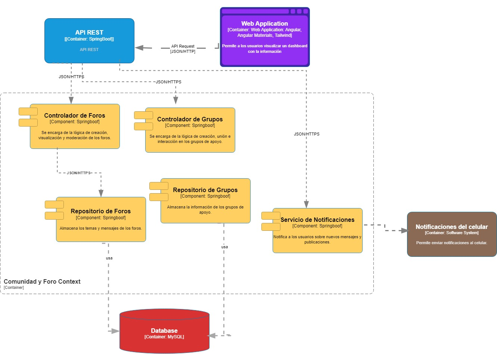
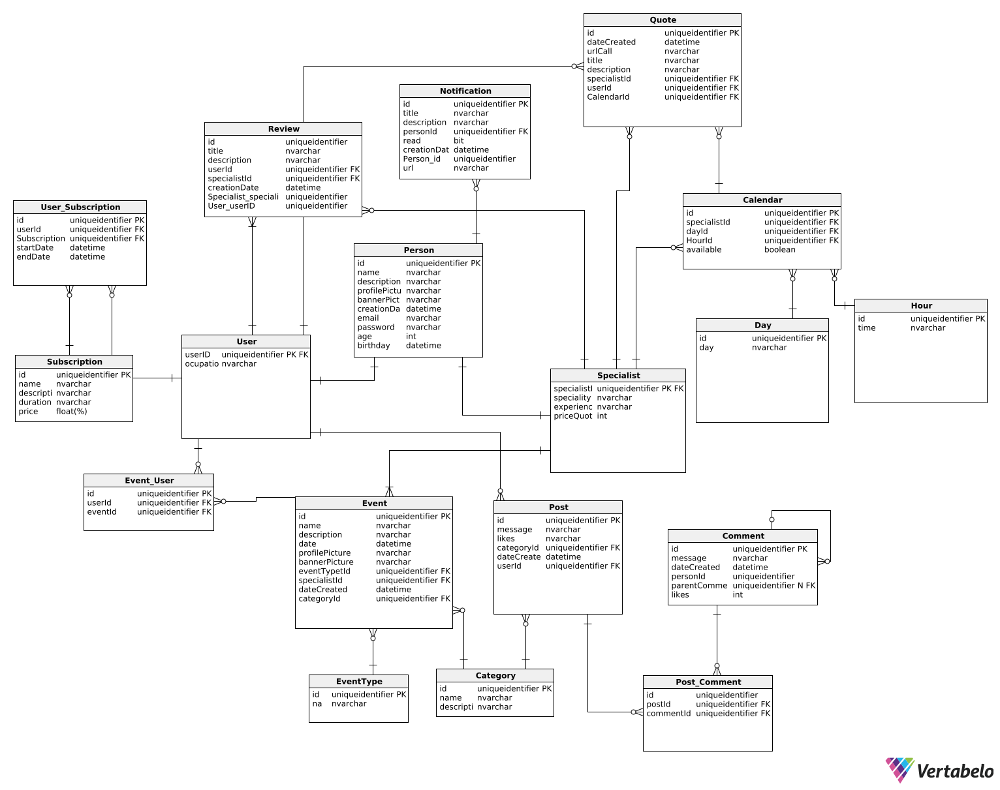

# <center>COURSE PROJECT</center>

<p align="center">
    <strong>Universidad Peruana de Ciencias Aplicadas</strong><br>
    </img><br>
    <strong>Ingeniería de Software</strong><br>
    <strong>Desarrollo de Aplicaciones Open Source - SW53</strong><br>
    <strong>Profesor: Elio Jefferson Navarrete Vilca </strong><br>
    <br>INFORME DEL TRABAJO FINAL
</p>

<center>

#### Startup: **HealthForAll**
#### Product: **ConnectionLink**

</center>

# Team  Members:
<center>

| Member                           | Code       |
|----------------------------------|------------|
| Alexander Paolo Justo Yauricasa  | u20191c054 |
| Burga loarte Anaely Zarely       | u202118264 |
| Djalma Santos Dioses Molina      | u201921405 |
| Nicolas Sebastian Esteban Garcia | u202217485 |
| Johan Príncipe Godoy             | u202014511 |
| Torrejon Navarro Braulio Rodrigo         | u201711828 |
</center>  

# Registro de Versiones del Informe

| Version | Fecha | Autor | Descripcion de Modificacion |
| ----------- | ----------- | ----------- | ----------- |
| 0.0 | 21/03/2024 | Grupo 3 | Se crea el documento |
| 1.0 | 22/03/2024 | Grupo 3 | Se crean las ramas correspondientes |
| 1.1 | 24/03/2024 | Grupo 3 | Capitulo I |
| 1.1 | 29/03/2024 | Grupo 3 | Capitulo II |
| 1.1 | 01/04/2024 | Grupo 3 | Capitulo III |
| 1.1 | 07/04/2024 | Grupo 3 | Capitulo IV |

# Project Report Collaboration Insights

[URL del repositorio](https://www.example.com)

(Imagenes de los commits cada entrega)

# Student Outcome 3

|Criterio Especifico| Acciones Realizadas                                                                                                                                                                                |Conclusiones|
|-|-----------------------------------------------------------------------------------------------------------------------------------------------------------------------------------------------------------------------------------------------------------------------------------------------------------------------------------------------------------------------------------------------------------------------------------------------------------------------------------------------------------------------------------------------------------------------------------------------------------------------------------------------------------------------------------------------------------------------------------------------------------------------------------------------------------------------------------------------------------------------------------------------------------------------------------------------------------------------------------------------------------------------------------------------------------------------------------------------------------------------------------------------------------------------------------------------------------------------------------------------------------------------------------------------------------------------------------------------------------------------------------------------------------------------------------------------------------------------------------------------------------------------------------------------------------------------|-|
|Comunica oralmente sus ideas y/o resultados con objetividad a público de diferentes especialidades y niveles jerarquicos, en el marco del desarrollo de un proyecto en ingeniería.| Nicolas Esteban:<br> **TB1:** Durante el proyecto, adquirí habilidades para transmitir conceptos complejos de manera comprensible a diversos grupos, lo que aumentó notablemente la colaboración y el compromiso con nuestra labor. Este proceso subrayó la relevancia de ajustar mi comunicación según el entorno, una lección de gran valor para mi desarrollo profesional futuro. <br><br>Anaely Zarely:<br>**TB1**: Durante la ejecución del proyecto, conseguí transmitir de manera eficiente tanto los resultados como el proceso seguido, empleando Lean UX como enfoque principal. Además, compartí los descubrimientos fundamentales derivados de nuestra investigación en experiencia de usuario (UX).<br><br>Djalma Santos:<br>**TB1**: Cumplí eficazmente con las responsabilidades asignadas, respetando los horarios, normativas y plazos acordados por el equipo. <br><br>Alexander Paolo:<br>**TB1**: Durante la realización del proyecto, logré expresar de manera clara todas mis ideas durante las reuniones de equipo. Además, llevé a cabo una entrevista con un usuario potencial, donde expliqué el propósito de la misma y la información que necesitaba recopilar.<br><br>Johan Principe:<br>**TB1**: A lo largo del proyecto, progresé satisfactoriamente en las responsabilidades asignadas y fortalecí habilidades interpersonales como la comunicación dentro del equipo. Además, obtuve una comprensión más sólida del proceso a seguir, lo que permitió su enfoque desde diversas perspectivas para una mejor posicionamiento.<br><br>Braulio Torrejon:<br>**TB1:** Organizamos múltiples reuniones en grupo con el fin de intercambiar propuestas para el desarrollo óptimo de nuestro proyecto. Además, llevamos a cabo entrevistas que nos proporcionaron información valiosa para la creación de nuestra aplicación web. |Gracias a la eficiencia y la organización que mantuvimos, respaldadas por un sólido marco de trabajo establecido dentro del grupo, alcanzamos nuestro objetivo de desarrollar el primer entregable de manera precisa y oportuna. La colaboración efectiva, la comunicación clara y el compromiso compartido con los plazos establecidos fueron pilares clave en nuestro éxito|
|Comunica en forma escrita ideas y/o resultados con objetividad a público de diferentes especialidades y niveles jerarquicos, en el marco del desarrollo de un proyecto en ingeniería..| Nicolas Esteban:<br> **TB1:** En mi participación en el proyecto, me dediqué a comunicar mis ideas y los resultados obtenidos de manera clara y objetiva. Desde la elaboración de informes hasta la realización de presentaciones, mi objetivo fue hacer que la información fuera accesible y comprensible para todos los involucrados.  <br><br> Anaely Zarely:<br>**TB1:** A lo largo de este proyecto, me encargué de documentar de manera adecuada el emprendimiento, utilizando las herramientas pertinentes y siguiendo las convenciones de idioma, estructura de nombres y prácticas de programación establecidas en los aspectos de la solución. Además, realicé y documenté minuciosamente los procesos de Lean UX, diseño, prototipado, entre otros, con el objetivo de lograr una comunicación efectiva con una amplia gama de audiencias.<br><br>Djalma Santos:<br>**TB1**: Utilizando herramientas colaborativas en línea, pude mejorar mi capacidad de comunicación y colaboración en equipo de manera significativa. Estas plataformas facilitaron la interacción y el intercambio de ideas entre los miembros del equipo, lo que contribuyó a un ambiente de trabajo más eficiente y productivo.<br><br>Alexander Paolo:<br>**TB1**: En esta fase del proyecto, me dediqué a elaborar el análisis de requisitos de manera detallada, lo que sentó las bases para el desarrollo posterior. Luego, me enfoqué en la creación de la base de datos del sistema y en la construcción del diagrama de clases, asegurándome de que ambos elementos estuvieran alineados con los requerimientos identificados y contribuyeran a la solidez y funcionalidad del proyecto en su conjunto. <br><br>Johan Principe:<br>**TB1**: Desarrollé mis propuestas para el proyecto siguiendo meticulosamente el marco de la ingeniería de software. Esta metodología me permitió aplicar principios y prácticas establecidas, garantizando así la calidad y la coherencia en el desarrollo del proyecto. <br><br>Braulio Torrejon:<br>**TB1:** La investigación realizada para este proyecto fue exhaustivamente documentada y resultó fundamental para el modelado de nuestra solución. En esta fase, mi responsabilidad fue investigar sobre posibles competidores, lo que nos proporcionó información valiosa para aprender de sus errores y aciertos, ayudándonos así a mejorar nuestra estrategia y diseño.                                                                                                                                                                                                       |Gracias a las herramientas colaborativas brindadas y las aplicaciones de comunicación logramos establecer fechas y límites para nuestros trabajos y de esta manera mantenernos informados sobre el progreso de los demas miembros del equipo.|

# Contenido

[Registro de Versiones del Informe](#registro-de-versiones-del-informe)

[Project Report Collaboration Insights](#project-report-collaboration-insights)

[Student Outcome](#student-outcome)

[Capítulo I: Introducción](#capítulo-i-introducción)

[1.1 Startup Profile](#11-startup-profile)  
[1.1.1. Descripción de la Startup](#111-descripción-de-la-startup)  
[1.1.2. Perfiles de integrantes del equipo](#112-perfiles-de-integrantes-del-equipo)

[1.2. Solution Profile](#12-solution-profile)  
[1.2.1 Antecedentes y problemática](#121-antecedentes-y-problemática)  
[1.2.2 Lean UX Process.](#122-lean-ux-process)  
[1.2.2.1. Lean UX Problem Statements.](#1221-lean-ux-problem-statements)  
[1.2.2.2. Lean UX Assumptions.](#1222-lean-ux-assumptions)  
[1.2.2.3. Lean UX Hypothesis Statements.](#1223-lean-ux-hypothesis-statements)  
[1.2.2.4. Lean UX Canvas.](#1224-lean-ux-canvas)

[1.3. Segmentos objetivo.](#13-segmentos-objetivo)

[Capítulo II: Requirements Elicitation & Analysis](#capítulo-ii-requirements-elicitation--analysis)

[2.1. Competidores](#21-competidores)  
[2.1.1. Análisis competitivo]()  
[2.1.2. Estrategias y tácticas frente a competidores](#211-análisis-competitivo)

[2.2. Entrevistas](#22-entrevistas)  
[2.2.1. Diseño de entrevistas](#221-diseño-de-entrevistas)    
[2.2.3. Análisis de entrevistas](#223-análisis-de-entrevistas)

[2.3. Needfinding](#23-needfinding)  
[2.3.1. User Personas](#231-user-personas)  
[2.3.2. User Task Matrix](#232-user-task-matrix)  
[2.3.3. User Journey Mapping](#233-user-journey-mapping)  
[2.3.4. Empathy Mapping](#234-empathy-mapping)  
[2.3.5. As-is Scenario Mapping](#235-as-is-scenario-mapping)

[2.4. Ubiquitous Language](#24-ubiquitous-language)

[Capítulo III: Requirements Specificatio](#capítulo-iii-requirements-specification)

[3.1. To-Be Scenario Mapping](#31-to-be-scenario-mapping)

[3.2. User Stories](#32-user-stories)

[3.3. Impact Mapping](#33-impact-mapping)

[3.4. Product Backlog](#34-product-backlog)

[Capítulo IV: Product Desig](#capítulo-iv-product-design)

[4.1. Style Guidelines](#41-style-guidelines)  
[4.1.1. General Style Guidelines](#411-general-style-guidelines)  
[4.1.2. Web Style Guidelines](#412-web-style-guidelines)

[4.2. Information Architecture](#42-information-architecture)  
[4.2.1. Organization Systems](#421-organization-systems)  
[4.2.2. Labeling Systems](#422-labeling-systems)  
[4.2.3. SEO Tags and Meta Tag](#423-seo-tags-and-meta-tags)  
[4.2.4. Searching Systems](#424-searching-systems)   
[4.2.5. Navigation Systems](#425-navigation-systems)

[4.3. Landing Page UI Design](#43-landing-page-ui-design)   
[4.3.1. Landing Page Wireframe](#431-landing-page-wireframe)  
[4.3.2. Landing Page Mock-up](#432-landing-page-mock-up)

[4.4. Web Applications UX/UI Design](#44-web-applications-uxui-design)  
[4.4.1. Web Applications Wireframes](#441-web-applications-wireframes)  
[4.4.2. Web Applications Wireflow Diagrams](#442-web-applications-wireflow-diagrams)  
[4.4.2. Web Applications Mock-ups](#442-web-applications-mock-ups)   
[4.4.3. Web Applications User Flow Diagrams](#443-web-applications-user-flow-diagrams)

[4.5. Web Applications Prototyping](#45-web-applications-prototyping)

[4.6. Domain-Driven Software Architecture](#46-domain-driven-software-architecture)  
[4.6.1. Software Architecture Context Diagram](#461-software-architecture-context-diagram)  
[4.6.2. Software Architecture Container Diagrams](#462-software-architecture-container-diagrams)  
[4.6.3. Software Architecture Components Diagrams](#463-software-architecture-components-diagrams)

[4.7. Software Object-Oriented Design](#47-software-object-oriented-design)  
[4.7.1. Class Diagrams](#471-class-diagrams)  
[4.7.2. Class Dictionary](#472-class-dictionary)

[4.8. Database Design](#48-database-design)  
[4.8.1. Database Diagram](#481-database-diagram)

[Capítulo V: Product Implementation, Validation & Deploymen](#capítulo-v-product-implementation-validation--deployment)

[5.1. Software Configuration Management](#51-software-configuration-management)  
[5.1.1. Software Development Environment Configuration](#511-software-development-environment-configuration)  
[5.1.2. Source Code Management](#512-source-code-management)  
[5.1.3. Source Code Style Guide & Conventions](#513-source-code-style-guide--conventions)  
[5.1.4. Software Deployment Configuration](#514-software-deployment-configuration)

[5.2. Landing Page, Services & Applications Implementation](#52-landing-page-services--applications-implementation)  
[5.2.1. Sprint 1 ](#521-sprint-1)  
[5.2.1.1. Sprint Planning 1](#5211-sprint-planning-1)  
[5.2.1.2. Sprint Backlog 1](#5212-sprint-backlog-1)  
[5.2.1.3. Development Evidence for Sprint Review](#5213-development-evidence-for-sprint-review)  
[5.2.1.4. Testing Suite Evidence for Sprint Review](#52x4-testing-suite-evidence-for-sprint-review)  
[5.2.1.5. Execution Evidence for Sprint Review](#52x5-execution-evidence-for-sprint-review)  
[5.2.1.6. Services Documentation Evidence for Sprint Review](#52x6-services-documentation-evidence-for-sprint-review)  
[5.2.1.7. Software Deployment Evidence for Sprint Review](#52x7-software-deployment-evidence-for-sprint-review)  
[5.2.1.8. Team Collaboration Insights during Sprint](#52x8-team-collaboration-insights-during-sprint)

[5.3. Validation Interviews](#53-validation-interviews)  
[5.3.1. Diseño de Entrevistas](#531-diseño-de-entrevistas)  
[5.3.2. Registro de Entrevistas](#532-registro-de-entrevistas)  
[5.3.3. Evaluaciones según heurísticas](#533-evaluaciones-según-heurísticas)

[5.4. Video About-the-Product](#54-video-about-the-product)

[Conclusiones](#conclusiones)

[Conclusiones y recomendaciones](#conclusiones-y-recomendaciones)

[Video About-the-Team](#video-about-the-team)

[Bibliografía](#bibliografía)

[Anexos](#anexos)

# Student Outcome

| Criterio Especifico                                                                                                                                                                  | Acciones Realizadas                                                                                                                                                                  | Conclusiones           |
|--------------------------------------------------------------------------------------------------------------------------------------------------------------------------------------|--------------------------------------------------------------------------------------------------------------------------------------------------------------------------------------|------------------------|
| Comunica oralmente sus ideas y/o resultados con objetividad a público de diferentes especialidades y niveles jerarquicos, en el marco del desarrollo de un proyecto en ingeniería    | Johan Príncipe Godoy:<br> *TB1:* Implementación del User Persona, Task Matrix, Empathy Map, Journey Map, As-Is y To-Be Map. Además, documentación de los commits en el github.       | Su texto de conclusion |
| Comunica en forma escrita ideas y/o resultados con objetividad a público de diferentes especialidades y niveles jerárquicos, en el marco del desarrollo de un proyecto eningeniería. | Johan Príncipe Godoy:<br> *TB1:* Encargado de realizar la sección de sprint donde se incluye el sprint backlog y sprint planning. Creación y organización del Sprint 1 en el Trello. | Su texto de conclusion |

# Capítulo I: Introducción

## 1.1. Startup Profile

### 1.1.1. Descripción de la Startup

Nuestra startup [nombre] tiene como objetivo conectar a personas que presentan algún tipo de bienestar emocional, tales como estrés laboral, ansiedad social y necesitan ayuda de especialistas en salud mental. Si estás estresado, ansioso o tienes otros problemas similares, nuestra aplicación se encargará de ofrecer un espacio donde puedes expresar lo que te está pasando. Los usuarios pueden participar en pequeños foros donde pueden hablar sobre sus problemas y recibir recomendaciones y/o consejos acerca de ejercicios de relajación que pueden adoptar como rutina, los cuales son ofrecidos por especialistas en salud mental y también podrán participar de talleres y eventos gratuitos ofrecidos por especialistas. Además, ofrecemos un plan de suscripción que incluye acceso a eventos exclusivos, análisis detallados de tu salud emocional y la posibilidad de reservar hasta 3 citas con nuestros especialistas, que están disponibles en la aplicación. Se contará con acceso al perfil del especialista además de ver una sección de reseñas de usuarios beneficiados con sus terapias, con el fin de que puedan adquirir sus servicios. Este proyecto busca proporcionar a los usuarios afectados un espacio seguro para expresar sus preocupaciones y recibir apoyo de especialistas y otros usuarios dispuestos a ofrecer consejos y ayuda.

#### 1.1.2. Perfiles de integrantes del equipo
<!-- poner las rutas de las imagenes de assets en src -->
| Miembros del equipo                                                                                                                     | Codigo Estudiante | Carrera                | Conocimientos / Habilidades                                                   |
|-----------------------------------------------------------------------------------------------------------------------------------------|-------------------|------------------------|-------------------------------------------------------------------------------| 
| Nicolas Sebastian Esteban Garcia   | U202217485        | Ingenieria de software | C++, JS, HTML, CSS, Phyton. Comunicación asertiva y facil adaptación          |
| Djalma Santos Dioses Molina                                                    | U201921405        | Ingenieria de software | HTML, CSS, JS, C++, C#, SQL, Phyton. Responsable.                             |
| Esteban Garcia, Nicolas Sebastian                                              | U202217485        | Ingenieria de software | C++, JS, HTML, CSS, Phyton                                                    |
| Príncipe Godoy, Johan 	              | U202014511        | Ingenieria de software | C++, JS, HTML, CSS, Phyton, SQL, MongoDB. Trabajo en equipo y responsabilidad |
| Burga Loarte Anaely <br />	          | U202118264        | Ingenieria de software | C++, C#, JS, HTML, CSS, Phyton                                                | 
| Torrejon Navarro Braulio Rodrigo	               | U201711828        | Ingenieria de software | C++, C#, JS, HTML, CSS, Phyton                                                | 
| Alexander Paolo Justo Yauricasa                                                | U201921405        | Ingenieria de software | Phyton, HTML, JS, C++, C#, SQL. Facil adaptación y responsable                |

## 1.2. Solution Profile

### 1.2.1 Antecedentes y problemática

Durante el año 2023, se realizó una investigación exhaustiva sobre los índices de salud mental, evidenciando una compleja interacción de factores que afectan el bienestar emocional de la población. Estudios como el llevado a cabo por Johnson et al. (2023) subrayaron la importancia de considerar no solo las diferencias de género, sino también otros aspectos como la edad, el entorno socioeconómico y la historia de trauma en la manifestación de trastornos emocionales. Se encontró que las mujeres tenían una mayor prevalencia de trastornos de ansiedad y depresión, lo que se asociaba con factores como la carga de responsabilidades familiares y sociales, así como el estrés crónico. Por otro lado, los hombres mostraban una mayor propensión hacia trastornos relacionados con la ira y la impulsividad, aunque estas tendencias podrían estar influenciadas por normas de género y roles sociales preestablecidos.

Además, investigaciones como el Informe Global sobre la Salud Mental (2023) destacaron la importancia de abordar los determinantes sociales de la salud mental, como la discriminación, la marginalización y la falta de acceso a recursos básicos. Estos factores, junto con la estigmatización asociada a los trastornos emocionales, representan barreras significativas para la búsqueda de ayuda y tratamiento. En consecuencia, se requieren intervenciones integrales que no solo se centren en el diagnóstico y tratamiento clínico, sino también en la promoción de entornos sociales y comunitarios que fomenten el apoyo mutuo, la inclusión y la resiliencia emocional.

Durante el año 2023, se realizó una investigación exhaustiva sobre los índices de salud mental, evidenciando una compleja interacción de factores que afectan el bienestar emocional de la población. Estudios como el llevado a cabo por Johnson et al. (2023) subrayaron la importancia de considerar no solo las diferencias de género, sino también otros aspectos como la edad, el entorno socioeconómico y la historia de trauma en la manifestación de trastornos emocionales. Se encontró que las mujeres tenían una mayor prevalencia de trastornos de ansiedad y depresión, lo que se asociaba con factores como la carga de responsabilidades familiares y sociales, así como el estrés crónico. Por otro lado, los hombres mostraban una mayor propensión hacia trastornos relacionados con la ira y la impulsividad, aunque estas tendencias podrían estar influenciadas por normas de género y roles sociales preestablecidos.

Además, investigaciones como el Informe Global sobre la Salud Mental (2023) destacaron la importancia de abordar los determinantes sociales de la salud mental, como la discriminación, la marginalización y la falta de acceso a recursos básicos. Estos factores, junto con la estigmatización asociada a los trastornos emocionales, representan barreras significativas para la búsqueda de ayuda y tratamiento. En consecuencia, se requieren intervenciones integrales que no solo se centren en el diagnóstico y tratamiento clínico, sino también en la promoción de entornos sociales y comunitarios que fomenten el apoyo mutuo, la inclusión y la resiliencia emocional.

* What?

Se trata de aplicación web diseñada para conectar a personas que experimentan problemas de bienestar emocional, como estrés laboral y ansiedad social, con especialistas en salud mental y otros usuarios dispuestos a ofrecer apoyo y consejos.

* Who?

La startup se encarga de desarrollar y mantener la aplicación. Además, contará con especialistas en salud mental que ofrecen sus servicios dentro de la plataforma, así como usuarios que buscan ayuda y apoyo emocional.

* When?
  
La aplicación estará disponible para su uso en cualquier momento, permitiendo a los usuarios acceder a recursos y apoyo cuando lo necesiten, además de poder realizar consultas en nuestros diversos foros las 24 horas.

* Why?
  
La startup busca proporcionar un espacio seguro y accesible para que las personas puedan expresar sus preocupaciones emocionales y recibir apoyo de especialistas y otros usuarios. El objetivo es mejorar el bienestar emocional de los usuarios y ayudarles a encontrar formas efectivas de manejar el estrés y la ansiedad.

* How?

La aplicación ofrece diferentes características, incluyendo foros donde los usuarios pueden hablar sobre sus problemas y recibir recomendaciones y consejos de especialistas en salud mental y otros usuarios. También proporciona acceso a talleres y eventos gratuitos organizados por especialistas, así como un plan de suscripción que incluye beneficios adicionales, como análisis detallados de la salud emocional y la posibilidad de reservar citas con especialistas.

* How much?

La aplicación estará disponible para su descarga de forma gratuita, pero también ofrece un plan de suscripción que proporciona acceso a funciones adicionales por una tarifa. El costo del plan de suscripción y los precios de los servicios ofrecidos dentro de la aplicación pueden variar dependiendo de la estructura de precios establecida por la startup.

### 1.2.2 Lean UX Process.

#### 1.2.2.1. Lean UX Problem Statements.

Para personas que experimentan problemas de bienestar emocional, como estrés laboral y ansiedad social, encontrar un espacio seguro para expresar sus preocupaciones, recibir apoyo de especialistas en salud mental y conectar con otros usuarios dispuestos a ofrecer ayuda y consejos es una tarea desafiante. A diferencia de los recursos tradicionales, como terapias cara a cara o grupos de apoyo, no existe una plataforma centralizada y accesible que proporcione una solución integral para satisfacer estas necesidades. Esto crea una brecha en la disponibilidad de apoyo emocional oportuno y eficaz, dejando a las personas afectadas sin recursos adecuados para abordar sus problemas emocionales y mejorar su bienestar general. Ante ello, nos proponemos proporcionar a nuestros usuarios un servicio de calidad y efectivo que les permita encontrar alivio y apoyo en sus momentos de necesidad. A través de nuestra plataforma, nos esforzamos por ofrecer un espacio inclusivo y accesible donde puedan conectarse con especialistas en salud mental y otros usuarios dispuestos a ofrecer consejos y apoyo. Es por este motivo que, como startup, abordaremos la resolucion de la siguiente cuestión: ¿Como podemos absolver los problemas que presentan nuestros usuarios con el fin de ofrecer un servicio de calidad y efectivo?

#### 1.2.2.2. Lean UX Assumptions.

|Business Assumptions|User Assumptions|
|-|-|
|Creemos que nuestros usuario de la aplicación estan interesados en mejorar su bienestar emocional y controlar sus emociones  |Los usuarios de este aplicación son personas de diferentes edades que son mayores de 18 años, las cuales tengan problemas para expresar su malestar emocional de manera abierta |
|Se asume que la demanda de servicios de salud mental a través de nuestra aplicación web seguirá creciendo, respaldando así la viabilidad del negocio a largo plazo |Nuestra aplicacióm presentará una gran demanda de usuarios, debido a la interfaz intuitiva y  facil accesibilidad. |
|Los usuarios usaran los foros de la comunidad para interactuar con diversas personas en el globo que presenten algun problema similiar  |La aplicación ofrecerá un facil acceso a los foros de la comunidad con el fin de que los usuarios puedan comunicarse facilmente |
|Los usuarios tendran la posibilidad de interactuar con un persona especialista en el problema que se debate, el cual será previamente calificado como persona apta | La aplicación garantizará que los especialistas sean personas aptas para dar algun tipo de recomendación a traves de la validación de sus datos personales |
|Los usuarios deben tener la posibilidad de interactuar con un especialista, para el cual podra reservar una cita de acuerdo a su disponibilidad |La aplicación mostrará una interfaz donde se visualice el perfil del especialista con sus datos personales y horarios disponibles para reservar una cita |
|Los usuarios deben tener la posibilidad de inscribirse a eventos gratuitos realizados por especialistas en el área |La aplicación debe mantener un registro de los eventos proximos a realizar y mostrarlo a los usuarios para que posteriormente puedan inscribirse a traves de un formulario |
|Los usuarios tendrán la posibilidad de pagar por una suscripcion, la cual ofrecerá una gran cantidad de nuevas funcionalidades|La aplicación implementará nuevas funcionalidades, como la inscripcion a talleres y eventos exclusivos, ademas de poder reservar una cantidad de citas durante el mes de suscripcion, entre otros  |
|Los usuarios podran dejar una reseña o una calificacion al especialista luego de haber recibido su terapia luego de la cita brindada al usuario previamente|La aplicación te dará la posibilidad de dejar una reseña o calificacion al especialista luego de haber sido completada la cita, la cual se podrá visualizar junto a otros reseñas hechos por otros usuarios |

#### 1.2.2.3. Lean UX Hypothesis Statements.

* Creemos que los usuarios que experimentan estrés laboral y ansiedad social estarán dispuestos a utilizar una aplicación web como medio para expresar sus preocupaciones y recibir apoyo emocional de especialistas en salud mental y otros usuarios. Sabremos que hemos tenido exito, si el usuario encuentre este ambiente bastante cómodo y puede expresarse libremente poe mdio de la plataforma.

* Creemos que al proporcionar una plataforma centralizada y accesible que combine características como foros de discusión, talleres y acceso a especialistas en salud mental, los usuarios encontrarán una solución integral para satisfacer sus necesidades emocionales.

* Creemos que al ofrecer un plan de suscripción con beneficios adicionales, como acceso a eventos exclusivos y reservas de citas con especialistas, podremos generar ingresos sostenibles y rentables para la startup. Sabremos que hemos tenido exito si los usuarios optan por pagar una suscripcion, ya que se ofrece una gran variedad de nuevas funcionalidades.

* Creemos que los usuarios estarán dispuestos a participar activamente en los foros de discusión de la aplicación, compartiendo sus experiencias y ofreciendo apoyo emocional a otros usuarios. Sabremos que hemos tenido exito si se presenta una mayor cantidad de usuarios que comparten sus opiniones en los foros creados

* Creemos que al ofrecer eventos gratuitos y talleres exclusivos para usuarios suscritos, aumentaremos la retención de usuarios y fomentaremos la conversión de usuarios gratuitos a usuarios de pago. Sabremos que hemos tenido exito si se presenta una mayor demanda de usuarios que adquieren una suscripcion.

#### 1.2.2.4. Lean UX Canvas.


#### Enlace Miro: https://miro.com/app/board/uXjVKZJsmRs=/?share_link_id=496612858930

## 1.3. Segmentos objetivo.

|                           | Segmento 1 | Segmento 2 |
| ------------------------- | ---------- | ---------- |
| Variables                 | Usuarios que presentan problemas en su salud mental y desean recurrir a la yuda de otras personas y/o especialistas           | Especialistas que deseen ofrecer sus servicios para apoyar a los usuarios afectados           |
| Geográfica                | En el Perú se ha contabilizado más de 1 millón 333 mil atenciones en salud mental durante el año 2023.           | En el Perú durante el primer semestre del 2023 se realizaron 6,959 mil asistencias en salud mental por especialistas.           |
| Demográfica               | No hay distincion de género, pueden ser jóvenes adultos, adultos de mediana edad o personas mayores.           | Especialistas que se encuentren trabajando en un centro de salud certificado          |
| Psicológica               | Los usuarios pueden tener una necesidad específica de recibir apoyo y orientación emocional y pueden experimentar niveles variables de estrés y ansiedad.           | Nivel de empatía y habilidad para comprender y responder a las necesidades emocionales de los usuarios, además del compromiso con altos estándares éticos en la práctica clínica.           |
| Función de comportamiento | Busqueda de apoyo, en el cuál actúan buscando una plataforma donde puedan encontrar apoyo emocional y orientación, los niveles de interacción social pueden variar en línea, algunos pueden ser más propensos a participar activamente en discusiones y actividades en la plataforma que otros.            | Deben presentar disposición a colaborar con otros profesionales de la salud mental y a trabajar en equipo y actúan buscando oportunidades para ampliar su base de clientes y ofrecer sus servicios a aquellos que los necesitan.           |

---

# Capítulo II: Requirements Elicitation & Analysis

## 2.1. Competidores.
Esta sección estará dividia en 2 segmentos. La primera parte se realizará el análisis de los competidores más conocidos en el área en el que se desarrolla nuestro proyecto. En la segunda parte vamos a analizar los métodos y estrategias para poder hacerles frente y lograr destacar entre ellas.

### 2.1.1. Análisis competitivo.
En este apartado se realizará el análisis de 3 competidores, directos o indirectos, con un modelo de negocio similar o con ofertas parcialmente similares.

| Competitive Analysis Landscape        |     |
| ------------------------------------- | --- |
| ¿Por qué llevar a cabo este análisis? | Llevamos a cabo el análisis de los competidores directos e indirectos de nuestro producto, con el fin de poder indentificar sus debilidades , fortalezas, misión, visión, su público objetivo, entre otros aspectos. Esto nos va a servir para desarrollar ventajas competitivas y mejorar nuestro producto.  |

|                     |                                                       | (Nosotros)                                                                                                                     | Buenoco                                                                     | Kalma Peru                                           |
| ------------------- | ----------------------------------------------------- | ------------------------------------------------------------------------------------------------------------------------------ | --------------------------------------------------------------------------- | ---------------------------------------------------- |
| PERFIL              | Overview                                              | Nuestra aplicación web ofrece un espacio seguro y accesible para que las personas encuentren apoyo emocional y consejos sobre bienestar mental. | plataforma innovadora que ofrece terapia psicológica online a través de un sistema de matching único.  | Organización especializada en el Perú, orientada en tratar problemas clínicos y preventivos en Salud Mental   |
|                     | Ventaja competitiva ¿Qué valor ofrece a los clientes? | Enfoque en la comunidad, ofreciendo un espacio seguro donde los usuarios pueden interactuar, compartir experiencias y recibir apoyo emocional   | Test gratuito, seguimiento, selección rigurosa del especialista.  |  Bajo un staff de especialistas, con experiencia en todos los casos señalados                                         |                                                                       
|                     | Mercado Objetivo                                      | Personas que experimentan problemas de bienestar emocional, como estrés laboral y ansiedad social  | Personas que buscan ayuda psicológica online | Personas con problemas en la salud mental                                                     |
| Perfil de marketing | Estrategia de Marketing                               | Publicidad en redes sociales. Acceso a todas las funcionalidades por un determinado tiempo, incluyendo las de pago. Descuentos o cupones para los nuevos usuarios registrados.   | Publicidad en google, programa de referidos  | Publicidad en google, sus colaboradores.                                            | 
| Redes Sociales                                                              | Televisión, Redes Sociales                           | Facebook, Instagram, Twitter                                                             |  Facebook, Instagram, Linkein   |   Facebook, Instagram, Youtube                                                                         |
| Perfil del producto | Productos y servicios                                 | Foros de comunidades en linea, talleres, plan de susbcripción, consultas individuales. | Algoritmo de matching avanzado, sistema de reserva de cita, analisis de tallados. | Diferentes tipos de temas de salud mental con psicologos especializados. |
|                     | Precios y costos                                      | Los precios de los servicios varían de acuerdo con los especialistas en salud mental y los costos del servicio premium varían de acuerdo con el tiempo de suscripción.  | Los precios de las sesiones de terapia psicológica online varían dependiendo del tipo de sesión. La primera consulta cognoscitiva es gratuita   | En la pagina web no tiene precio, pero dependiendo del tipo de sesión.    |
|                     | Canales de distribución (Web y/o Móvil)               | Play Store, Apple Store, iOS, Android, correo electrónico y página web.  | página web y correo electrónico.                    |                                      Whatsapp y meet                                     |

### 2.1.2. Estrategias y tácticas frente a competidores.

| Competidores -> |               | Nosotros | Buenoco | KalmaPeru |
| --------------- | ------------- | -------- | ----------- | ----------- |
| Análisis SWOT   | Fortalezas    | Variedad de servicio, foro de la comunidad, comunidad fuerte   | Selección rigurosa de psicologos  | Socios involucrados, ser el primero en el Perú |
|                 | Debilidades   | Requiere conexión a internet, enfocado solo en peru,    | Aceptación de terapias en linea, dependencia a la tecnologia     | no colocar su precio en la pagina principal, no aplicativo.       | lorem |
|                 | Oportunidades | Demanda creciente, expansión global, colaboraciones con organizaciones, accesiblidad    | Crecimiento de mercado, personalización, expansión internacional  | Funciona mejor para gente de edad mas avanzada.     | lorem |
|                 | Amenazas      | Competencia, que los psicologos se unan, seguridad, tencnologia   | Competencia, regulaciones, percepción publica.      | Competencia, falta de adaptación a la tecnologia      | lorem |

## 2.2. Entrevistas.

### 2.2.1. Diseño de entrevistas.

**Preguntas generales:**

1. ¿Podrías proporcionarnos tu nombre completo? 
2. ¿Qué edad tiene?
3. ¿Cuál es tu ocupación actual o solo estudios? 
4. ¿Podrías decirnos brevemente sobre tus intereses personales o profesionales? 
   
**Entrevistas usuario segmento 1: usuarios que buscan ayuda emocional por medio de una plataforma**

1. ¿Qué piensas de la idea de buscar ayuda emocional a través de una aplicación web? 
2. ¿Cómo te sentirías al compartir tus preocupaciones emocionales en una plataforma en línea? 
3. ¿Qué aspectos considerarías importantes al decidir utilizar una aplicación web para mejorar tu bienestar emocional? 
4. ¿Qué opinas sobre la posibilidad de recibir apoyo emocional de una comunidad en línea?	
5. ¿Cuáles serían tus expectativas al participar en una plataforma que ofrece recursos y consejos para el bienestar emocional?
6. ¿Qué características te gustaría ver en una aplicación web que ofrece apoyo emocional?
7. ¿Qué tipo de interacción esperarías tener con otros usuarios en una plataforma de ayuda emocional en línea?

**Entrevistas usuario segmento 2**

1. ¿Qué piensas de la idea de ofrecer tus servicios profesionales en una aplicación web? 
2. ¿Cómo crees que el uso de una plataforma digital puede influir en la forma en que proporcionas tratamiento o terapia? 
3. ¿Qué aspectos considerarías importantes al decidir unirte a una plataforma en línea para ofrecer tus servicios? 
4. ¿Qué desafíos anticipas al brindar servicios de salud mental a través de una aplicación web?
5. ¿Cómo crees que la tecnología puede mejorar tu capacidad para llegar a más personas que buscan ayuda emocional?
6. ¿Qué oportunidades crees que ofrece una plataforma digital para expandir tu práctica profesional en el campo de la salud mental?
7. ¿Qué crees que podría diferenciar a una aplicación web exitosa para profesionales de la salud mental de otras plataformas disponibles en línea?

### 2.2.2. Registro de entrevistas.

***Enlace Entrevistas:*** https://drive.google.com/drive/folders/11k8Bvr1FZljtDV1J2fFZM1UawkEcSi-B?usp=sharing

**Segmento 01: Personas con problemas de salud mental buscan apoyo emocional*** 

***Entrevistado 1***

Nombre: Sebastian Ramirez Hoffman  

Edad: 19 años   

Ocupación: Estudiante de Ingenieria de Software


Duración: 11:08

Enlace de entrevista: https://drive.google.com/file/d/1jh8pLWQNGsjuUY4qjBZL0ngEASCMfV5r/view?usp=sharing

**Resumen de la entrevista:** Nuestro entrevistado fue Sebastian Ramirez, estudiante de la carrera de Ingeniería de software, el cual cuenta con cierta experiencia en el uso de plataformas de debate o donde multiples usuarios pueden dar una opinión respecto a un tema en concreto. En base a ello, nos comentó como era el ambiente y que cualidades destacables tenian los foros en linea y como las personas pueden dar una opinión libre respecto al tema que se debate. Además, que la función mas relevante era el anonimato, ya que muchos de estos usuarios se expresan a traves de una cuenta, en la cual no se tiene conocimiento o no se garantiza de donde proviene el usuario que comenta. Luego de explicarle nuestra idea de negocio, nos comentó que seria una alternativa viable, ya que muchos foros en linea debaten diversos temas que no necesariamente guardan una relacion entre sí, sin embargo, el hecho de dar prioridad al tema de bienestar y cuidado emocional, donde se pueda contar con usuarios especialistas u otros usuarios que hayan pasado por dicho problema puedan ser libres de dar algun consejo.  

***Entrevistado 2***

Nombre: Harold Mayta Lopez  

Edad: 21 años   

Ocupación: Estudiante de Ingenieria de Software


Duración: 9:30

Enlace de entrevista: https://drive.google.com/file/d/1lSAuVtGM5KNiw88R8gcFNf6SD611oyKP/view?usp=sharing

**Resumen de la entrevista:** Nuestro entrevistado fue Sebastian Ramirez, estudiante de la carrera de Ingeniería de software, el cual cuenta con experiencia en la participación de foros en linea como Reddit. Respecto a ello, nos comento que existen diversos temas que se debaten dia a dia, con cientos de usuarios dispuestos a dar una opnión respecto a un tema especifico. Sin embargo, no mucha de esta información es confiable, o no se garantiza información veridica del usuario que comenta. Luego, resalto la suma importancia del anonimato en este tipo de comunidades en línea, ya que protegia la integridad de un usuario. Luego de comentarle nuestra idea de negocio, nos comentó que seria de gran ayuda contar con un foro en linea que se centre especificamente a todo lo relacionado a la salud mental, ya que es un tema que no se le da mucha relevancia, resalto que el hecho de contar con usuarios verificados como especialistas en el área, pueden dar un mejor aporte a los hilos o debates creados con los usuarios, además que esto ayudarpia a que la información proporcionada tenga mayor validez.

***Entrevistado 3***

Nombre: Camila Dias MigueldelPriego 

Edad: 23 años   

Ocupación: Estudiante de Diseño grafico


Duración: 4:56

Enlace de entrevista:  https://youtu.be/bM89i00o3_8
**Resumen de la entrevista:** Nuestra entrevistada fue Camila Dias, estudiante de diseño grafico, el cual ha tenido psicologos anteriormente, en la entrevista nos comentó que la idea de buscar ayuda empocional a travez de una aplicación web es una buena idea ya que siempre hay personas afuera en busca de ayuda y apoyo. Pero se sentiria un poco avergonzada de publicar sus problemas y preocupaciones en linea, asi que espera que haya un sistema de privacidad en ese aspecto. Un aspecto importante que es respetar la privacidad del otro, no intentar buscarlo y hacer algo con esa información. Sobre la posibilidad de recibir ayuda en linea, le parece una buena idea ya que hay gente que en linea conoce mucha gente y no sale mucho de casa, donde es mas facil compartir tus problemas con esas personas. Sus expectativas seria un lugar donde puedas descargarte emocionalmente allí. Le gustaria una buena moderación, ya que puede haber usuarios que fomenten o enves de querer ayudarte, quieren perjudicarte. Y en un tipo de interacción, le gustaria un lugar armonioso donde todos se ayuden entre ellos.

**Segmento 02: Profesionales de la salud mental que desean ayudar a mejorar la salud emocional de las personas**  

***Entrevistado 4***

Nombre: Diana Reyes Poma

Edad: 24 años

Ocupación: Psicologa  


Duración: 6:35

Enlace de entrevista:  https://drive.google.com/file/d/11QXtqWpK_JMpYyd_M54Ko4BwubY12gX8/view?usp=sharing 

**Resumen de la entrevista:** En esta ocasión entrevistó a la especialista de la salud mental Diana Reyes, la cual actualmente cursa los últimos años de la carrera de psicología. En la entrevista ella resalta la importancia de la ayuda en cualquier modalidad (virtual o presencial), si bien relata que la terapia virtual puede generar unos inconvenientes por el lado de la presencia del mismo psicólogo, no descarta esta alternativa en especial para gente que recorre largas distancias para encontrar un especialista o personas que tienen tiempos cortos para poder ir a un local de un especialista. Así mismo, Diana menciona que una aplicación de terapias virtuales podría ayudar a llegar a gente de todo tipo, tanto practicantes o especialistas de la salud mental como personas que necesitan ayuda y no saben donde encontrarla. Por último, ella dice que se encuentra interesada en una plataforma digital que abarque muchos temas del campo de la salud mental, que ayude tanto a pacientes como  a especialistas.

***Entrevistado 5***

Nombre: Carlos Alejandro De La Cruz Villaverde

Edad: 21 años

Ocupación: Psicologo



Duración: 5:44

Enlace de entrevista: https://drive.google.com/file/d/1b78YRx9V69vzEWJ2y58cUu7BwLTTaCzA/view?usp=sharing 

**Resumen de la entrevista:** En esta ocasión se entrevistó a Carlos De La Cruz Villaverde especialista de la salud mental, y una practicante de la carrera de psicología. El menciona que le parece interesante la idea de una aplicación que ayude en el campo de la salud mental, ya que no es muy común encontrar con servicios digitales como este, y podría ayudar a las personas a encontrarse más cerca de la ayuda requerida. Así mismo, expresa su interés en una plataforma digital que cubra diversos aspectos del ámbito de la salud mental, con el propósito de brindar apoyo tanto a pacientes como a especialistas. Aunque, el se preocupa por la seguridad de los datos de los clientes y especialistas, ya que estos suelen albergar contenido privado ya sea en sesiones o enfermedades de la salud mental. Por último, De La Cruz expone que este tipo de innovación web no muy común podría ser muy exitoso ya que la ayuda psicológica es muy necesita hoy en día y que más personas se animan a tratarse como un especialista.


### 2.2.3. Análisis de entrevistas.

**Segmento 01: Personas con problemas de salud mental buscan apoyo emocional** <br>

**Importancia de la privacidad y el anonimato:** <br>
   + Todos los entrevistados resaltan la importancia del anonimato en las plataformas donde se discuten temas muy sensibles como por ejemplo la salud mental.  El anonimato proporciona seguridad a las personas, se sienten mucho más cómodas para expresar sus preocupaciones sin temor a que sean juzgadas.
   + Camila resalta la importancia de la privacidad, preocupándose por la posibilidad de compartir sus problemas en línea y espera que haya un sistema que garantice la privacidad de los usuarios.

**Necesidad de un espacio en línea para el apoyo emocional y la ayuda mutua** <br>
   + Todos los entrevistados están de acuerdo en que exista un espacio en línea que se dedique al apoyo emocional y a discusiones de problemas de salud mental.
   + Todos los entrevistados resaltan la importancia de que haya un lugar donde puedan contar sus problemas emocionales, donde puedan recibir ayuda y apoyo de otros usuarios que puedan haber tenido problemas similares.

**Validación y veracidad de la información:** <br>
   + Harold habla sobre la importancia de contar con información verificada y usuarios especializados en el área de salud mental o emocional que puedan brindar información real y consejos de calidad.
   + Esta idea es también respaldada por Sebastian, este nos menciona que la información en múltiples foros o comunidades en línea puede que no sea confiable debido a la falta de verificación de los usuarios.

**Moderación y ambiente seguro:** <br>
   + Todos los entrevistados están de acuerdo en contar una moderación efectiva dentro de la plataforma para mantener un ambiente seguro y confiable.
   + Camila nos menciona la necesidad de que exista una moderación adecuada para evitar que los usuarios perjudiquen en lugar de ayudar a otros usuarios.

En resumen, todos los entrevistados están de acuerdo en la necesidad de una comunidad en línea donde las personas puedan recibir apoyo emocional, priorizando el anonimato, la privacidad, la validación de la información y una buena moderación de la plataforma para mantener un ambiente seguro y de ayuda mutua.<br><br>


**Segmento 02:Profesionales de la salud mental que desean ayudar a mejorar la salud emocional de las personas**<br>

**Importancia de la ayuda en la salud mental en cualquier modalidad:** <br>
   + Ambos entrevistados coinciden en la importancia de brindar ayuda emocional tanto de forma presencial como virtual. Estos nos comentan que la terapia virtual puede ser beneficiosa, en especial para aquellas personas que tienen dificultades para acceder a un especialista de forma presencial debido a falta de tiempo, entre otras situaciones.

**Interés en una plataforma digital de salud mental:** <br>
   + Ambos entrevistados muestran un gran interés en la idea de una aplicación web o plataforma dedicada a la salud emocional o mental. Estos consideran que este tipo de servicio podría llegar a muchas personas.

**Preocupación por la privacidad y seguridad de los datos:** <br>
   + Ambos entrevistados muestran preocupación por la seguridad de los datos en una aplicación o plataforma web de salud emocional o mental. Estos consideran que la información compartida durante las sesiones terapéuticas es muy sensible y que se debe garantizar la privacidad y confidencialidad de los usuarios y especialistas.

En resumen, ambos entrevistados están de acuerdo en brindar ayuda emocional de forma virtual o presencial, muestran interés en una aplicación o plataforma web dedicada a este fin y expresan su preocupación por la seguridad de los datos. Ambos entrevistados reconocen el potencial y el exito que podría tener esta web.


## 2.3. Needfinding.

### 2.3.1. User Personas.

**Segmento 1: Usuarios que presentan problemas en su salud mental y desean recurrir a la yuda de otras personas y/o especialistas**  


**Segmento 2: Especialistas que deseen ofrecer sus servicios para apoyar a los usuarios afectados**


### 2.3.2. User Task Matrix.

**Segmento 1: Usuarios que presentan problemas en su salud mental y desean recurrir a la yuda de otras personas y/o especialistas**

| Tarea                                    | Frecuencia | Severidad |
|------------------------------------------|------------|-----------|
| Buscar recursos de apoyo emocional       | Alta       | Alta      |
| Programar una cita con un consejero      | Media      | Alta      |   
| Practicar técnicas de relajación         | Alta       | Media     |
| Compartir experiencias con otros         | Baja       | Alta      |
| Encontrar información sobre salud mental | Alta       | Alta      |
| Practicar técnicas de relajación         | Media      | Alta      |
| Establecer metas de autocuidado          | Baja       | Alta      |
| Realizar actividades recreativas         | Baja       | Alta      |
| Mantener un diario de emociones          | Media      | Media     |

**Segmento 2: Especialistas que deseen ofrecer sus servicios para apoyar a los usuarios afectados**

| Tarea                                                             | Frecuencia | Severidad |
|-------------------------------------------------------------------|------------|-----------|
| Evaluar las necesidades del cliente                               | Alta       | Alta      |
| Diseñar un plan de tratamiento personalizado                      | Alta       | Alta      |   
| Brindar terapia individual o grupal                               | Alta       | Alta      |
| Seguir el progreso del cliente                                    | Alta       | Alta      |
| Proporcionar recursos y herramientas de autoayuda                 | Media      | Alta      |
| Colaborar con otros profesionales de la salud                     | Media      | Media     |
| Mantenerse actualizado en las últimas investigaciones y prácticas | Alta       | Alta      |

### 2.3.3. User Journey Mapping.

**Segmento 1: Usuarios que presentan problemas en su salud mental y desean recurrir a la yuda de otras personas y/o especialistas**  


**Segmento 2: Especialistas que deseen ofrecer sus servicios para apoyar a los usuarios afectados**


### 2.3.4. Empathy Mapping.

**Segmento 1: Usuarios que presentan problemas en su salud mental y desean recurrir a la yuda de otras personas y/o especialistas**  


**Segmento 2: Especialistas que deseen ofrecer sus servicios para apoyar a los usuarios afectados**


### 2.3.5. As-is Scenario Mapping.

**Segmento 1: Usuarios que presentan problemas en su salud mental y desean recurrir a la yuda de otras personas y/o especialistas**  


**Segmento 2: Especialistas que deseen ofrecer sus servicios para apoyar a los usuarios afectados**


## 2.4. Ubiquitous Language.

```
Texto ubiquo: Definicion de este
```

---

# Capítulo III: Requirements Specification

## 3.1. To-Be Scenario Mapping.

**Segmento 1: Usuarios que presentan problemas en su salud mental y desean recurrir a la yuda de otras personas y/o especialistas**  


**Segmento 2: Especialistas que deseen ofrecer sus servicios para apoyar a los usuarios afectados**


## 3.2. User Stories.

| HU0X | Historia Usuario  | "Descripcion" |
|------|-------------------|---------------|
| HU01 | Acceso a Recursos de Autocuidado  | Como usuario afectado por el estrés, quiero poder acceder a una variedad de recursos de autocuidado, como técnicas de respiración y meditación guiada, para ayudarme a manejar el estrés en el trabajo. | 
| HU02 | Participación en Grupos de Discusión Moderados           | Como usuario que busca apoyo emocional, deseo poder participar en grupos de discusión en línea moderados por especialistas en salud mental para compartir mis experiencias y recibir consejos de otros usuarios.        |
| HU03 | Programación de Sesiones de Terapia en Línea            | Como especialista en salud mental, quiero poder programar y conducir sesiones de terapia en línea con los usuarios para proporcionarles orientación y apoyo individualizado.        |
| HU04 | Notificaciones sobre Eventos y Talleres Gratuitos           | Como usuario interesado en mejorar mi bienestar emocional, deseo recibir notificaciones y recordatorios sobre eventos y talleres gratuitos relacionados con el manejo del estrés y la ansiedad.        |
| HU05 | Chat en Línea con Especialistas en Crisis           | Como usuario que busca acceso rápido a la ayuda, deseo poder chatear en línea con un especialista en salud mental cuando experimente crisis emocionales o necesite apoyo inmediato.        |
| HU06 | Herramientas de Seguimiento del Progreso del Usuario           | Como especialista en salud mental, quiero tener acceso a herramientas de seguimiento del progreso del usuario para poder monitorear y evaluar su bienestar emocional a lo largo del tiempo.        |
| HU07 | Acceso a Terapias Asequibles           | Como usuario que busca opciones de terapia asequibles, deseo tener acceso a una lista de especialistas en salud mental que ofrezcan tarifas asequibles o descuentos para sesiones de terapia en línea.       |
| HU08 | Colaboración con Profesionales de Salud Mental           | Como especialista en salud mental, quiero poder colaborar con otros profesionales de la salud mental en la plataforma para discutir casos de usuarios y compartir mejores prácticas.        |
| HU09 | Interfaz de Usuario Intuitiva y Navegación Eficiente           | Como usuario que busca una experiencia de usuario intuitiva, deseo una interfaz de usuario simple y fácil de navegar para acceder a los recursos y servicios disponibles en la aplicación de manera rápida y eficiente.        |
| HU10 | Descripción Detallada de los Beneficios Premium          | Como usuario interesado en explorar las funciones premium, deseo poder acceder a una descripción detallada de los beneficios y características adicionales incluidas en el plan de suscripción premium.        |
| HU11 | Personalización del Perfil de Usuario          | Como usuario registrado, deseo poder personalizar mi perfil de usuario agregando información relevante, como mis intereses, desafíos emocionales específicos y preferencias de notificación, para recibir recomendaciones y contenido personalizado.      |
| HU12 | Interacción en los Foros de Discusión           | Como usuario participante, deseo poder interactuar con otros usuarios y especialistas en los foros de discusión, comentando en publicaciones, dando me gusta a respuestas útiles y compartiendo recursos relevantes, para sentirme parte de una comunidad de apoyo.       |
| HU13 | Exploración de Perfiles de Especialistas           | Como usuario en búsqueda de apoyo profesional, deseo explorar perfiles detallados de especialistas en salud mental en la aplicación, que incluyan información sobre su experiencia, enfoques terapéuticos y disponibilidad de citas.      |
| HU14 | Valoración y Reseñas de Usuarios           | Como usuario interesado en la calidad de los servicios, deseo poder leer reseñas y valoraciones de otros usuarios sobre las sesiones de terapia y servicios ofrecidos por los especialistas en salud mental, para tomar decisiones informadas sobre mi cuidado emocional.      |
| HU15 | Visualización de Disponibilidad de Citas           | Como usuario, deseo poder ver fácilmente la disponibilidad de citas de los especialistas en un calendario interactivo, mostrando los horarios preestablecidos disponibles para programar una sesión.       |
| HU16 |  Adaptación a Múltiples Dispositivos         | Como usuario, deseo que la aplicación se adapte de manera fluida y eficiente a diferentes dispositivos, como teléfonos inteligentes, tabletas y computadoras de escritorio, para garantizar una experiencia consistente y optimizada en todos los dispositivos.      |


## 3.3. Impact Mapping.


## 3.4. Product Backlog.

| #Orden | User Story ID | Titulo     | Descripción | Story Points (1/2/3/5/8) |
| ------ | ------------- | ---------- | ----------- | ------------------------ |
| 1      | HU01          | Acceso a Recursos de Autocuidado | Como usuario estresado, quiero acceder a recursos de autocuidado como técnicas de respiración y meditación para gestionar el estrés laboral. | 5                        |
| 2      | HU2           | Participación en Grupos de Discusión Moderados | Como usuario buscando apoyo emocional, quiero unirme a grupos de discusión en línea con moderación profesional para intercambiar experiencias y recibir consejos de otros participantes. | 3 |
| 3      | HU3           | Programación de Sesiones de Terapia en Línea	 | Como especialista en salud mental, deseo realizar terapias en línea con los usuarios para brindarles orientación y apoyo personalizado. | 5 |
| 4      | HU4           | Notificaciones sobre Eventos y Talleres Gratuitos	 | Como usuario buscando mejorar mi bienestar emocional, quiero recibir recordatorios sobre eventos y talleres gratuitos enfocados en el manejo del estrés y la ansiedad. | 2 |
| 5      | HU05          | Chat en Línea con Especialistas en Crisis           | Como usuario necesitado de ayuda rápida, quiero chatear en línea con un especialista en salud mental para recibir apoyo inmediato durante crisis emocionales. | 3 |
| 6      | HU06          | Herramientas de Seguimiento del Progreso del Usuario           | Como profesional de la salud mental, deseo acceder a herramientas de seguimiento del progreso del usuario para evaluar su bienestar emocional a largo plazo.    | 3 |
| 7      | HU07          | Acceso a Terapias Asequibles        | Como usuario buscando terapia asequible, quiero acceder a una lista de especialistas en salud mental que ofrezcan tarifas bajas o descuentos para terapia en línea.  | 3 |
| 8      | HU08          | Colaboración con Profesionales de Salud Mental           | Como especialista en salud mental, deseo colaborar con otros profesionales de la plataforma para discutir casos de usuarios y compartir buenas prácticas.     | 2 |
| 9      | HU09          | Interfaz de Usuario Intuitiva y Navegación Eficiente           | Como usuario en busca de una experiencia intuitiva, quiero una interfaz sencilla y fácil de usar para acceder rápidamente a los recursos y servicios de la aplicación.        | 3 |
| 10     | HU10          | Descripción Detallada de los Beneficios Premium          | Como usuario interesado en las funciones premium, quiero ver una descripción detallada de los beneficios y características adicionales del plan de suscripción premium.        | 5 |
| 11     | HU11          | Personalización del Perfil de Usuario          | Como usuario registrado, quiero personalizar mi perfil añadiendo detalles como mis intereses, desafíos emocionales y preferencias de notificación, para recibir recomendaciones y contenido adaptado.      | 2 |
| 12     | HU12          | Interacción en los Foros de Discusión           | Como participante, quiero interactuar en los foros comentando, dando me gusta y compartiendo recursos para sentirme parte de una comunidad de apoyo.       | 2 |
| 13     | HU13          | Exploración de Perfiles de Especialistas           | Como usuario buscando apoyo profesional, quiero ver perfiles detallados de especialistas en salud mental en la aplicación, con información sobre su experiencia, enfoques terapéuticos y disponibilidad de citas.      | 2 |
| 14     | HU14          | Valoración y Reseñas de Usuarios           | Como usuario preocupado por la calidad, quiero leer reseñas de otros usuarios sobre las sesiones de terapia y servicios ofrecidos por los especialistas en salud mental para tomar decisiones informadas sobre mi cuidado emocional.      | 2 |
| 15     | HU15          | Visualización de Disponibilidad de Citas           | Como usuario, quiero ver la disponibilidad de citas de los especialistas en un calendario interactivo para programar fácilmente una sesión, mostrando los horarios disponibles.       | 2 |
| 16     | HU16          |  Adaptación a Múltiples Dispositivos         | Como usuario, quiero que la aplicación se adapte sin problemas a diferentes dispositivos (teléfonos inteligentes, tabletas, computadoras de escritorio) para asegurar una experiencia consistente y óptima en todos ellos.      | 5 |

# Capítulo IV: Product Design

## 4.1. Style Guidelines.

### 4.1.1. General Style Guidelines.

Como empresa emergente, nuestra meta es asegurar que la interfaz de nuestra aplicación CalmConnection transmita un sentido de profesionalismo, facilidad de uso y precisión para nuestros usuarios. Nos esforzamos en garantizar que los usuarios puedan llevar a cabo sus proyectos de manera eficaz, por lo que empleamos recursos visuales para atraer a nuestros segmento objetivo. Optamos por colores asociados al ámbito de la salud mental y utilizamos una tipografía con diferentes tamaños que garantiza la legibilidad.

**Color:** 
| Color | Descripcion | Muestra |
| ----- | ----------- | ------- |
| Color Primario | Celeste, usaremos este color ya que se asocia con el cielo despejado y el agua serena, ademas evoca una sensación de calma y serenidad |   |
| Color Segundario | Blanco, usaremos este color ya que es un color clásico y atemporal que también puede crear entornos tranquilos y serenos. Al combinar el blanco con otros tonos suaves se puede crear un ambiente aún más relajante y acogedor. |   |


**Tipografia:** 
| Tipografia | Fuente | Muestra |
| ---------- | ------ | ------- |
| Tipografia Principal | Fuente: Open Runde / Tamaño: 25 px - 55 px |  |
| Tipografia Segundario | Fuente: Arima / Tamño: 12 px - 20 px |  |


**Brand Overview:** 

Nuestra porpuesta suerge por la falta de recursos de ayuda en la salud mental, por lo que brindamos una solución tecnológica en la cual podrán encontrar un repertorio de ayuda psicologuica que necesiten por especialistas en el tema.   


### 4.1.2. Web Style Guidelines.

Nuestra página de inicio utiliza el Patrón minimalista en su diseño, que está pensado para orientar al usuario de manera fluida y eficiente a través de la página. En la parte superior, se presenta una barra de navegación con un tono oscuro, que transmite una sensación de seriedad y confianza. Esta barra incluye el logotipo y enlaces a secciones como "Inicio", "Servicios", "Acerca de nosotros", "Testimonios" y "Descargar". Se ha optado por una paleta de colores basada en tonos verdes, que reflejan el sector agrícola al que nos dedicamos en nuestra startup. Estos colores contrastan con el resto de la página, destacando así la invitación al usuario para descargar y probar nuestra aplicación.


## 4.2. Information Architecture.

En el proyecto "CalmConnection", la arquitectura de la información se diseña meticulosamente para garantizar una experiencia de usuario coherente y efectiva. Esta arquitectura se fundamenta en la comprensión profunda de las necesidades emocionales de los usuarios y las soluciones propuestas para abordarlas. A continuación, se detallan y se amplían los sistemas de arquitectura de información seleccionados:

### 4.2.1. Organization Systems.

En la creación del Lading Page y también de la aplicación web haremos uso del enfoque jerárquica. Esta metodología permitirá asignar la ubicación óptima a cada elemento requerido en el desarrollo y este enfoque jerárquico permite una navegación clara y fácil, lo que ayuda a los usuarios a encontrar rápidamente lo que están buscando y a comprender la estructura general de la aplicación. Para lograrlo, se tendrán en cuenta factores como etiquetas, especificaciones de pantalla y resolución. Asimismo, se diseñarán íconos utilizando una matriz, lo que facilitará la visualización de los detalles y contribuirá a mantener un proceso ordenado en todo momento.

- Selección: Jerárquico: El sistema de organización jerárquica se adapta perfectamente a las necesidades de "CalmConnection". Este enfoque estructura el contenido en un formato que refleja la importancia y la relación de los elementos entre sí. Por ejemplo, la página de inicio actúa como un punto central desde el cual los usuarios pueden acceder a los servicios principales, como los foros de discusión, eventos y opciones de suscripción. Desde allí, pueden navegar hacia abajo a través de niveles de contenido secundario para encontrar información más específica o detallada sobre temas relacionados con su bienestar emocional.

- Matrix: Si bien el enfoque de matriz permite una flexibilidad en la navegación, podría resultar abrumador para los usuarios debido a la cantidad de opciones disponibles. La organización jerárquica proporciona una estructura más clara y fácil de entender para los usuarios, lo que mejora la usabilidad y la experiencia general. Si bien no se aplicará ampliamente, el enfoque matricial se utilizará en áreas donde los usuarios puedan beneficiarse de la flexibilidad de elegir cómo desean explorar el contenido. Por ejemplo, podríamos permitir a los usuarios ordenar las publicaciones del foro por temas, fecha o popularidad, brindándoles opciones para personalizar su experiencia de navegación según sus preferencias individuales y se incluirá para que cuando el usuario quisiera consigurar aspectos de la cuenta creada pueda realizar los cambios necesario en apartados divididos.
  
- Sequential: Aunque este enfoque puede ser útil para guiar a los usuarios a través de un proceso paso a paso, no se adapta bien a la naturaleza diversa y multifacética de "CalmConnection". La organización jerárquica permite una exploración más libre y personalizada de los servicios y recursos disponibles. Sin embargo, se incluirá al momento de que los usuarios realicen la creación de sus cuenta o realicen el plan de suscripción que se ofrecerá en la aplicación.

- Esquemas de Categorización de Contenido:
Por Tópicos: La categorización por temas será fundamental en áreas como los foros de discusión y la biblioteca de recursos. Los usuarios podrán explorar y participar en discusiones sobre temas específicos relacionados con su bienestar emocional, como manejo del estrés, ansiedad social, técnicas de relajación, entre otros.

Según Audiencia:Se aplicará una categorización basada en secciones como el perfil del especialista y los eventos. Los usuarios podrán buscar y filtrar especialistas según sus áreas de especialización y experiencia, lo que les permitirá encontrar el apoyo más relevante para sus necesidades emocionales específicas.


### 4.2.2. Labeling Systems.

En "CalmConnection", hemos dedicado especial atención a seleccionar etiquetas descriptivas que guíen de manera clara y efectiva a nuestros usuarios a través de la aplicación. Cada etiqueta ha sido cuidadosamente elegida para reflejar con precisión el propósito y el contenido de las diversas secciones de nuestra plataforma, asegurando una experiencia de navegación fluida y satisfactoria.

- Inicio: La etiqueta "Inicio" actúa como la puerta de entrada a nuestra aplicación, ofreciendo a los usuarios una visión general de los servicios y recursos disponibles en "CalmConnection". Desde aquí, los usuarios pueden iniciar su viaje hacia el bienestar emocional explorando las diversas opciones y funcionalidades que ofrecemos.

- Servicios: Al seleccionar esta etiqueta, nuestros usuarios son conducidos a una sección que resalta los principales servicios ofrecidos por "CalmConnection". Desde foros de discusión hasta eventos especiales y opciones de suscripción, esta sección proporciona una descripción detallada de los recursos disponibles para nuestros usuarios.

- Quiénes Somos: La etiqueta "Quiénes Somos" les brinda a nuestros usuarios la oportunidad de conocer más sobre la historia y el equipo detrás de "CalmConnection". Aquí, compartimos nuestra misión, visión y valores, así como también presentamos al equipo comprometido con el desarrollo y mantenimiento de nuestra aplicación.

- Ayuda: En "CalmConnection", nos esforzamos por ofrecer apoyo y orientación a nuestros usuarios en cada paso del camino. La etiqueta "Ayuda" les proporciona acceso a recursos y guías diseñadas para resolver cualquier duda o problema que puedan encontrar durante su experiencia con nuestra aplicación.

- Preguntas: Nuestra sección de "Preguntas" ofrece respuestas a las consultas más comunes sobre el funcionamiento y los servicios de "CalmConnection". Desde detalles sobre la reserva de citas hasta información sobre eventos futuros, esta sección sirve como una valiosa fuente de información para nuestros usuarios.

- Testimonios: ¿Qué mejor manera de conocer los beneficios de "CalmConnection" que a través de las experiencias reales de nuestros usuarios? La etiqueta "Testimonios" presenta historias auténticas y reseñas de aquellos que han encontrado apoyo y soluciones a través de nuestra plataforma.

- Descargar: La etiqueta "Descargar" ofrece a nuestros usuarios un acceso rápido y conveniente para obtener la aplicación "CalmConnection" en sus dispositivos preferidos. Con enlaces directos a las diferentes versiones disponibles, facilitamos que nuestros usuarios comiencen a disfrutar de los beneficios de nuestra aplicación en cualquier momento y lugar.

Con estas etiquetas descriptivas, buscamos garantizar que la experiencia de navegación en "CalmConnection" sea clara, intuitiva y completamente centrada en las necesidades de nuestros usuarios.

### 4.2.3. SEO Tags and Meta Tags

Las etiquetas de SEO y metaetiquetas desempeñan un papel crucial en la visibilidad y la accesibilidad de "CalmConnection" en los motores de búsqueda. Las etiquetas SEO consisten en términos clave pertinentes y descripciones breves, con el propósito de que los motores de búsqueda puedan indexar y clasificar eficazmente el contenido de la aplicación. Por otro lado, las metaetiquetas ofrecen detalles adicionales acerca de la página, como el título y la descripción que se visualizan en los resultados de búsqueda. Estas etiquetas son esenciales para aumentar la visibilidad y la clasificación de "CalmConnection" en los motores de búsqueda, lo que resulta en un mayor tráfico y una mayor exposición para la aplicación.

- Landing Page:

Tittle: CalmConnection.<br>
Description: CalmConnection - CalmConnection Official Landing Page.<br>
Keywords: emotional, connection, mental health, psychologists.<br>
Authors: CalmConnection team.<br>

- Aplicación web:

Tittle: CalmConnection.<br>
Description: CalmConnection - CalmConnection Official Web Page <br>
Keywords: emotional, connection, mental health, psychologists.<br>
Authors: CalmConnection team.<br>

### 4.2.4. Searching Systems.

Dentro de "CalmConnection" hemos diseñado un sistema de búsqueda que permite a nuestros usuarios encontrar rápida y eficientemente información relevante para mejorar su bienestar emocional.

**¿Qué se busca?**
Nuestros usuarios tienen la posibilidad de explorar una amplia variedad de temas relacionados con su salud mental y emocional. Desde técnicas para manejar el estrés hasta estrategias para abordar la ansiedad social, nuestro sistema de búsqueda abarca una amplia gama de necesidades.

**¿Qué resultados se mostrarán?**
Al realizar una búsqueda, los usuarios encontrarán una lista diversa de resultados que cubren diferentes aspectos de su consulta. Esto incluye publicaciones significativas de nuestros foros de discusión, próximos eventos relacionados con el tema, talleres disponibles que pueden ofrecer herramientas adicionales, y perfiles detallados de especialistas en salud mental que pueden proporcionar orientación y apoyo personalizado.

**Interfaz de Búsqueda:**
La interfaz de búsqueda ha sido diseñada pensando en la facilidad de uso y la accesibilidad. Los usuarios pueden escribir sus consultas en un cuadro de búsqueda dedicado, y nuestra función de autocompletar les ofrece sugerencias relevantes para agilizar el proceso. Una vez realizada la búsqueda, los resultados se presentan de manera clara y ordenada, con opciones de filtrado y clasificación disponibles para una navegación más eficiente y personalizada.

Con nuestro sistema de búsqueda, garantizamos que los usuarios de "CalmConnection" puedan acceder de manera rápida y sencilla a recursos que promuevan su bienestar emocional, brindándoles el apoyo necesario para afrontar sus desafíos emocionales con confianza y seguridad.


### 4.2.5. Navigation Systems.
En "CalmConnection", nos esforzamos por asegurar que la navegación dentro de nuestra aplicación de salud mental sea intuitiva y efectiva, ofreciendo a los usuarios una experiencia enriquecedora y satisfactoria mientras buscan apoyo y recursos para fortalecer su bienestar emocional.

- Sistema de Navegación Jerárquica:
Hemos adoptado una estructura jerárquica en nuestra plataforma para facilitar a los usuarios el acceso a diversas áreas diseñadas para abordar sus necesidades emocionales. Desde la página de inicio, los usuarios pueden explorar los foros de discusión para conectarse con otros usuarios, acceder a eventos y talleres organizados por especialistas en salud mental, y explorar perfiles de expertos para programar citas y obtener asesoramiento personalizado. Esta jerarquía claramente definida les permite a los usuarios encontrar rápidamente los recursos y el apoyo que están buscando, guiándolos de manera lógica a través de la aplicación.

- Sistema de Navegación Global:
Nuestra aplicación cuenta con un sistema de navegación global que permite a los usuarios moverse sin problemas entre las distintas secciones y regresar a la página de inicio en cualquier momento. Esta coherencia en la navegación brinda a los usuarios una sensación de familiaridad y control mientras exploran las diferentes características y servicios disponibles en "CalmConnection". Este sistema se complementa con el movimiento vertical, permitiendo a los usuarios desplazarse por la página con facilidad utilizando la barra de navegación, lo que garantiza que siempre puedan regresar a la página principal con un solo clic.

- Sistema de Navegación Local:
Además del sistema global, ofrecemos un sistema de navegación local que permite a los usuarios acceder a páginas específicas dentro de la aplicación, como perfiles de especialistas o eventos específicos. Este sistema de navegación local actúa como un complemento al sistema global, permitiendo a los usuarios explorar contenido relacionado de manera intuitiva y acceder a información detallada según sus necesidades específicas.

Con estos sistemas de navegación, proporcionamos a los usuarios de "CalmConnection" una guía clara y efectiva a través de nuestra aplicación, facilitándoles el acceso a recursos y apoyo para mejorar su bienestar emocional y promover una vida más saludable y equilibrada.

## 4.3. Landing Page UI Design.

### 4.3.1. Landing Page Wireframe.


### 4.3.2. Landing Page Mock-up.


## 4.4. Web Applications UX/UI Design.

### 4.4.1. Web Applications Wireframes.

Inicio de sesión

<br/>

Crear cuenta usuario:

<br/>

Crear cuenta especialista:

<br/>

**Vista usuario que no cuenta con suscripcion:**

Home:

<br/>

Foros:

<br/>

Calendario:

<br/>

Eventos:
<br/>

Analisis:
<br/>

Hilos: 
<br/>

*Buttons call to action (CTA):*

Crear post:

<br/>

Specialist profile:

<br/>

Realizar una cita a especialista:

<br/>

Pago especialista para reserva:

<br/>

Reserva de cita exitosa:

<br/>

Registro de eventos:

<br/>

Registro de evento exitoso:

<br/>

**Vista usuarios que cuentan con suscripcion:**  

Progreso y metrica de analisis emocional:

<br/>

Eventos exclusivos gratuitos:

<br/>

Reserva de citas gratuita:

<br/>

**Vista especialistas de salud:**

LinkFigma: https://www.figma.com/file/at7BldTcKVIputFtHq485B/Wireframes-AppWeb?type=design&node-id=48%3A553&mode=design&t=Qz6xmr9ECJ9kfuKH-1 

Home:

<br/>

Foros:

<br/>

Calendario:

<br/>

Eventos:
<br/>

Bandeja de entrada:
<br/>


*Buttons call to action (CTA):*

Crear nuevo evento:

<br/>

Creacion de nuevo evento exitosa:

<br/>


### 4.4.2. Web Applications Wireflow Diagrams.

**User goal 1:** Inicio de sesion / registro de usuario

<br/>

**User goal 2:** Crear post

<br/>

**User goal 3:** Reserva de cita con especialista

<br/>

**User goal 4:** Usuario quiere unirse a un hilo

<br/>

**User goal 5:** Usuario se registra a un evento

<br/>

**User goal 6:** Especialista crea un evento

<br/>

**User goal 7:** Usuario paga para registrarse en evento

<br/>

Enlace miro al diagrama: https://miro.com/app/board/uXjVKUq4xVs=/?share_link_id=40081653876 

### 4.4.2. Web Applications Mock-ups.

Inicio de sesión

<br/>

Crear cuenta usuario:

<br/>

Crear cuenta especialista:

<br/>

**Vista usuario que no cuenta con suscripcion:**

Home:

<br/>

Foros:

<br/>

Calendario:

<br/>

Eventos:
<br/>

Analisis:
<br/>

Hilos: 
<br/>

*Buttons call to action (CTA):*

Crear post:

<br/>

Specialist profile:

<br/>

Realizar una cita a especialista:

<br/>

Reserva de cita exitosa:

<br/>

Registro de eventos:

<br/>

Registro de evento exitoso:

<br/>

**Vista usuarios que cuentan con suscripcion:**  

Progreso y metrica de analisis emocional:

<br/>

Eventos exclusivos gratuitos:

<br/>

Reserva de citas gratuita:

<br/>

**Vista especialistas de salud:**

Home:

<br/>

Foros:

<br/>

Calendario:

<br/>

Eventos:
<br/>

Bandeja de entrada:
<br/>


*Buttons call to action (CTA):*

Crear nuevo evento:

<br/>

Creacion de nuevo evento exitosa:

<br/>

LinkFigma: https://www.figma.com/file/at7BldTcKVIputFtHq485B/Wireframes-AppWeb?type=design&node-id=48%3A553&mode=design&t=Qz6xmr9ECJ9kfuKH-1 


### 4.4.3. Web Applications User Flow Diagrams.

**User goal 1:** Inicio de sesion / registro de usuario

<br/>

**User goal 2:** Crear post

<br/>

**User goal 3:** Reserva de cita con especialista

<br/>

**User goal 4:** Usuario quiere unirse a un hilo

<br/>

**User goal 5:** Usuario se registra a un evento

<br/>

**User goal 6:** Especialista crea un evento

<br/>

**User goal 7:** Usuario paga para registrarse en evento

<br/>

Link Miro: https://miro.com/app/board/uXjVKUpWmTM=/?share_link_id=579453948455 

## 4.5. Web Applications Prototyping.

<br/>

URL del prototipo en Figma: https://www.figma.com/proto/DIMymIVBJZalayMlZRKLTL/WebApplication-Prototyping?page-id=0%3A1&type=design&node-id=1-59&viewport=732%2C710%2C0.09&t=CsrxiKf8dLaT76ly-1&scaling=scale-down&starting-point-node-id=1%3A59&show-proto-sidebar=1&mode=design 

## 4.6. Domain-Driven Software Architecture.

### 4.6.1. Software Architecture Context Diagram.


2. Bounded Context Map: Muestra la relacion entre bounded contexts (los bounded context son como una burbuja que
   encapsula palabras clave en los procesos para poder
   diferenciarlos [Ej. Bounded context enfocado en las ventas(ventas), otro en revisar el stock(gestion) y otro enfocado en los proveedores (suministros)])
   Se hace como un brainstorm y se ve en que pueden conectarse o
   comunicarse [se usa un circulo entre conexiones lineales (upstream o downstream) para definir comunicacion, algunos context se pueden integrar para representar por ejemplo un share model por database, tambien se mencionan los (third party context para definir los restful apis)]

### 4.6.2. Software Architecture Container Diagrams.



### 4.6.3. Software Architecture Components Diagrams.

1. Component diagrams: Estos van a mostrar las ordenes, procesos, mensajes y componentes utilizados en el uso del
   aplicativo, claro se deben hacer diferentes de estos para cada bounded o USER GOALS

   **Gestión del usuario Context Component Diagram:**


**Terapias y citas Context Component Diagram:**


**Comunidad y foro Context Component Diagram:**



## 4.7. Software Object-Oriented Design.

### 4.7.1. Class Diagrams.


### 4.7.2. Class Dictionary.

**User:** <br>
La clase User representa a los usuarios regulares del sistema. Estos usuarios pueden buscar ayuda emocional, participar en eventos, interactuar en comunidades y reservar citas con especialistas. Pueden unirse a comunidades para conectarse con otros usuarios, compartir experiencias y buscar apoyo mutuo en temas relacionados con la salud mental.

**Specialist:** <br>
La clase Specialist representa a los profesionales de la salud mental que ofrecen sus servicios en la plataforma. Estos especialistas pueden iniciar sesión en el sistema, listar los eventos que organizan, ver las citas programadas con sus pacientes y acceder a los perfiles de los pacientes. Además, pueden participar en comunidades para brindar apoyo y asesoramiento a los usuarios regulares en temas relacionados con la salud mental.

**Community:** <br>
La clase Comunidad representa grupos de usuarios que se reúnen en la plataforma para discutir temas relacionados con la salud mental, compartir experiencias y brindarse apoyo mutuo. Los usuarios regulares pueden unirse a estas comunidades para conectarse con otros usuarios, buscar apoyo emocional y participar en discusiones grupales. Los especialistas también pueden participar en comunidades para ofrecer asesoramiento y orientación a los usuarios en busca de ayuda.

**Event:** <br>
La clase Event representa eventos organizados en la plataforma, que pueden incluir talleres, charlas, sesiones de terapia grupales, etc. Los eventos pueden ser creados tanto por usuarios especialistas como por administradores del sistema. Pueden tener una variedad de atributos como nombre, fecha, ubicación y tipo. Los usuarios pueden asistir a estos eventos para obtener información, participar en actividades grupales y recibir apoyo de especialistas y otros participantes.

**Thread:** <br>
La clase Thread representa una conversación o tema de discusión dentro de una comunidad. Cada hilo puede contener mensajes o respuestas de usuarios y puede estar relacionado con un tema específico relacionado con la salud mental. Los usuarios pueden crear nuevos hilos, responder a hilos existentes y participar en discusiones dentro de la comunidad.

**Date:** <br>
La clase Date representa fechas disponibles para citas con especialistas. Estas fechas pueden ser definidas por los especialistas como horarios disponibles para atender a sus pacientes. Los usuarios pueden seleccionar estas fechas para reservar citas.

**Calendar:** <br>
La clase Calendar está asociada a un especialista y almacena las fechas disponibles para citas. Cada calendario puede contener múltiples fechas disponibles para citas con el especialista. Los usuarios pueden acceder al calendario del especialista para reservar citas en los horarios disponibles.

**Quote:** <br>
La clase Quote representa una cita programada entre un usuario y un especialista en una fecha específica. Al reservar una cita, se crea una instancia de esta clase que incluye la información de la fecha y hora de la cita, así como los detalles del usuario y el especialista involucrados.

**Category:** <br>
La clase Category representa las categorías a las que pueden pertenecer eventos o comunidades en la plataforma. Cada evento o comunidad puede estar asociado a una o más categorías para facilitar la búsqueda y la organización. Las categorías pueden incluir temas como "Salud Mental", "Autoayuda", "Psicología Adulta".

**Subscription:** <br>
La clase Subscription representa una suscripción pagada ofrecida en la plataforma. Contiene información sobre el nombre de la suscripción, una descripción de los servicios incluidos, la duración de la suscripción y el precio asociado. Los usuarios pueden adquirir suscripciones para acceder a funciones premium o contenido exclusivo.

**User Subscription:** <br>
La clase User Subscription representa la suscripción de un usuario a un plan de suscripción específico. Al adquirir una suscripción, se crea una instancia de esta clase que incluye información sobre el usuario que adquirió la suscripción, el tipo de suscripción, la fecha de inicio y la fecha de finalización de la suscripción.

**EventType:** <br>
La clase EventType define los tipos de eventos que pueden ocurrir en la plataforma. Cada tipo de evento tiene un nombre descriptivo y una breve descripción que indica cómo se llevará a cabo el evento. Por ejemplo, puede haber eventos presenciales, eventos en línea (streaming), talleres virtuales, sesiones grupales, entre otros. 

**Review:** <br>
La clase Review representa un calificacion del usuario hacia el especialista, este evento se realiza cuando un usuario tiene un cita privada con un especialista.

**Notification:** <br>
La clase Notification esta ascociada a los Usarios y los Especialista, estos pueden recibir notificaciones cuando alguien ha comentado su hilo, cuando han reservado una cita con un especialista, cuando le han dado megusta a su comentario, etc.
## 4.8. Database Design.

### 4.8.1. Database Diagram.



# Capítulo V: Product Implementation, Validation & Deployment

## 5.1. Software Configuration Management.

En la siguiente sección, detallaremos las herramientas, convenciones, referencias y configuraciones empleadas a lo largo del desarrollo del proyecto, que contribuyeron a mantener la consistencia en el trabajo realizado.

### 5.1.1. Software Development Environment Configuration.

En este apartado, se van a mencionar los distintos productos de software empleados por el equipo de desarrollo, para llevar acabo las actividades relacionadas con la elaboración del proyecto.

**Project Management:**

1. **Discord: https://discord.com/** Aunque originalmente su uso es mas para la comunidad de gamers para comunicarse entre ellos, Discord también se puede utilizar para mejorar la experiencia del usuario a travez de diferentes lugares de comunicación, fijar mensajes, diferentes canales de texto y actividad de los integrantes del grupo.

2. **WhatsApp: https://web.whatsapp.com/** WhatsApp es una aplicación de mensajería instantánea que se utiliza para la comunicación en tiempo real. Aunque no es una herramienta de gestión de proyectos, se puede utilizar para mantener en contacto con los miembros del equipo. 

**Requirements Managemnts:**

1. **Trello: https://trello.com/** Es un software de gestión de proyectos, que facilita asignar y organizar las tareas a realizar. 


**Product UX/UI Design**

1. **Figma: https://www.figma.com/** Figma es una herramienta de edición gráfica, en donde se puede diseñar y prototipar páginas web. Se utilizó para crear los wireframes, mock-ups del proyecto

2. **UXPressia: https://uxpressia.com/** Es una herramienta en línea que permite a los equipos de trabajo identificar y comprender los problemas, necesidades y comportamiento del usuario, lo utilizamos para realizar el Empathy Map, Journey Map, Impact Map

3. **Miro: https://miro.com/es/** Es una plataforma colaborativa el cual permite crear y usar pizarras digitales personalizadas en tiempo real. Lo utilizamos para la creación del As-is y To-Be scenario map.

**Software Development:**

1. **Landing Page:** Para la creación de la landing page, se utilizaron las tecnologias base del desarrollo web: HTML5, CSS3 y JavaScript, Tambien se usó ReactJs y el framework Tailwindcss para facilitar el desarrollo del proyecto.

**Software Documentation:**

1. **GitHub: https://github.com/** GitHub es una plataforma de desarrollo colaborativo que utiliza el sistema de control de versiones Git. Se utiliza para alojar, revisar y colaborar en proyectos de desarrollo de software, lo que facilita la colaboración entre desarrolladores.

2. **LucidChart: https://lucid.app/** LucidChart es una plataforma que cuenta con opciones para la creación de diagramas, mapas mentales, flujos y más, con el uso de plantillas y tableros con edición en tiempo real. Fue utilizado en el desarrollo del diagrama de clases UML

3. **Structurizr: https://www.structurizr.com/** Es una plataforma que permite modelado de diagramas de arquitectura de software por medio de código. Structurizr fue utilizado para crear el modelo C4 de nuestro proyecto.


### 5.1.2. Source Code Management.

El manejo y organización del trabajo se llevaron a cabo mediante una organización en Github Organización: https://github.com/SI730-SW53-OpenSource-Grupo5 Landing Page Repository: https://github.com/SI730-SW53-OpenSource-Grupo5/LandingPage-ConnectionLink.git 

Asimismo, para llevar a cabo un mejor control de cómo crear ramas y realizar cambios en el código fuente, se procedió a utilizar GitFlow.

De este modo, se tenían 2 ramas principales: main y development.

* main: En esta rama almacenaremos las versiones oficiales de nuestro repositorio que ya deben pasar a producción.
* development: Esta rama se utilizará como rama de integración para las “feature” branches. Una vez alcance un estado estable y el equipo lo considere listo para ser lanzado, se unirá a la rama main.
  
**Commit Conventions:**    
El formato de nuestros commits sigue la estructura de los “Conventional Commits” en su versión 1.0.0 (https://www.conventionalcommits.org/en/v1.0.0/) con el objetivo de proporcionar una lectura sencilla de los mismos. Por ello seguimos el siguiente formato: "< type>[optional scope]: < description>" Donde:

* type: Especifica el tipo de cambio realizado, únicamente puede ser feat, fix, update, etc.
* scope: Es el alcance que tiene nuestro commit.
* description: Es un breve resumen de los cambios de código.

### 5.1.3. Source Code Style Guide & Conventions.
En el proyecto hemos hecho uso de algunas convenciones y guia de estilos para el desarrollo del Landing Page.

**React:**

   + Componentes: Se fomenta la creación de componentes para mantener un código limpio y modularizado.
   + Nomenclatura Descriptiva: Utilizamos nombres descriptivos para que se pueda entender cual es su función dentro de la página.
   + Estado y Props: Hacemos uso de los estados y props para pasar datos entre componentes y tener una página reactiva.

**Tailwind CSS:**
   + Clases Utilitarias: Usamos las clases proporcionadas por Tailwind para darle estilos a los elementos de forma eficiente.

**General:**
   + Estructura de Carpetas Organizadas: Mantenemos una estructura de carpetas organizadas para los archivos de React, facilitando así la navegación y entendimiento del proyecto. 

**Git:**
   + Ramas Descriptivas: Utilizamos  nombres de ramas descriptivas para una gestión eficiente del código y las versiones.
   + Flujo de Trabajo Colaborativo: Hacemos uso de ramas para el desarrollo colaborativo.


### 5.1.4. Software Deployment Configuration.

En esta entrega, hemos finalizado nuestra Landing Page y configurado su despliegue de la siguiente manera:

Repositorio GitHub: El código de la Landing Page está alojado en un repositorio específico dentro de nuestra comunidad pública en GitHub.

Vercel: Utilizamos la aplicación Vercel para desplegar la página. Esto nos permite una visualización clara y accesible para los usuarios.

Esta configuración nos brinda un método eficiente y transparente para el despliegue de nuestro proyecto, asegurando una experiencia óptima para nuestros usuarios.

## 5.2. Landing Page, Services & Applications Implementation.

### 5.2.1. Sprint 1

#### 5.2.1.1. Sprint Planning 1.

| Sprint 1                   | Implementación de funcionalidades y diseño de la aplicación.                                                                                                                                           |
|----------------------------|--------------------------------------------------------------------------------------------------------------------------------------------------------------------------------------------------------|
| Sprint Planning Background |                                                                                                                                                                                                        |
| Date                       | 07/04/2024                                                                                                                                                                                             |
| Time                       | 20:00                                                                                                                                                                                                  |
| Location                   | Reunión realizada mediante Discord                                                                                                                                                                     |
| Prepared By                | Esteban Garcia, Nicolas Sebastian                                                                                                                                                                      |
| Attendees                  | Justo Yauricasa, Alexander Paolo / Burga Loarte, Anaely Zarely /<br/> Dioses Molina, Djalma Santos / Esteban Garcia, Nicolas Sebastian <br/> Príncipe Godoy, Johan / Torrejon Navarro, Braulio Rodrigo |
| Sprint Goal & User Stories |                                                                                                                                                                                                        |
| Sprint 1 Goal              | Realizar y desplegar el Landing Page                                                                                                                                                                   |
| Sprint 1 Velocity          | 35                                                                                                                                                                                                     |
| Sum of Story Points        | 30                                                                                                                                                                                                     |

#### 5.2.1.2. Sprint Backlog 1.

| Id   | Title            | Id   | Title                           | Description                                                                           | Estimations (Hours) | Assigned To                       | Status |
|------|------------------|------|---------------------------------|---------------------------------------------------------------------------------------|---------------------|-----------------------------------|--------|
| CC01 | Testimonials     | C01  | Sección Testimonials responsive | Desarrollo e implementación de los estilos que corresponden a la sección Testimonials | 3                   | Dioses Molina, Djalma Santos      | Done   |
| CC02 | Features         | C02  | Sección Features responsive     | Desarrollo e implementación de los estilos que corresponden a la sección Features     | 3                   | Dioses Molina, Djalma Santos      | Done   |
| CC03 | Button component | C03  | Button Design responsive        | Desarrollo e implementación de los estilos que corresponden al Button                 | 2                   | Esteban Garcia, Nicolas Sebastian | Done   |
| CC04 | Navbar component | C04  | Sección Navbar responsive       | Desarrollo e implementación de los estilos que corresponden a la sección Navbar       | 3                   | Esteban Garcia, Nicolas Sebastian | Done   |
| CC05 | Contact          | C05  | Sección Contact responsive      | Desarrollo e implementación de los estilos que corresponden a la sección Contact      | 3                   | Justo Yauricasa, Alexander Paolo  | Done   |
| CC06 | Footer           | C06  | Sección Footer responsive       | Desarrollo e implementación de los estilos que corresponden a la sección Footer       | 2                   | Justo Yauricasa, Alexander Paolo  | Done   |
| CC07 | Hero             | C07  | Sección Hero responsive         | Desarrollo e implementación de los estilos que corresponden a la sección Hero         | 4                   | Torrejon Navarro, Braulio Rodrigo | Done   |
| CC08 | About            | C08  | Sección About responsive        | Desarrollo e implementación de los estilos que corresponden a la sección About        | 3                   | Torrejon Navarro, Braulio Rodrigo | Done   |
| CC09 | Service          | C09  | Sección Service responsive      | Desarrollo e implementación de los estilos que corresponden a la sección Service      | 2                   | Príncipe Godoy, Johan             | Done   |
| CC10 | Prices           | C010 | Sección Prices responsive       | Desarrollo e implementación de los estilos que corresponden a la sección Prices       | 2                   | Burga Loarte, Anaely Zarely       | Done   |


   
Link del trello: https://trello.com/b/xObDcpU6/sprint-1

#### 5.2.1.3. Development Evidence for Sprint Review.

| Repository                 | Branch                   | Commit ID | Commit Message                                                                      | Commit Message Body | Commited On(Date) |
|----------------------------|--------------------------|-----------|-------------------------------------------------------------------------------------|---------------------|-------------------|
| LandingPage-ConnectionLink | feature/footer           | b28816c   | Update Footer.jsx                                                                   | -                   | 12/04/2024        |
| LandingPage-ConnectionLink | feature/contact          | d429bb8   | Update Contact.jsx                                                                  | -                   | 12/04/2024        |
| LandingPage-ConnectionLink | feature/prices           | 9ad3e6b   | feat: add Prices.jsx                                                                | -                   | 12/04/2024        |
| LandingPage-ConnectionLink | feature/features-section | a624c36   | feat: add FeatureCard Component and Features Component with Tailwind                | -                   | 12/04/2024        |
| LandingPage-ConnectionLink | feature/testimonials     | a16c0c0   | feat: add TestimonialCard Component and Testimonials Component with Tailwind Styles | -                   | 12/04/2024        |
| LandingPage-ConnectionLink | feature/about            | 7e85194   | Update About.jsx                                                                    | -                   | 12/04/2024        |
| LandingPage-ConnectionLink | feature/hero             | 56ab21c   | Update Hero.jsx                                                                     | -                   | 12/04/2024        |
| LandingPage-ConnectionLink | feature/service          | c663461   | feat: Service section added                                                         | -                   | 12/04/2024        |
| LandingPage-ConnectionLink | feature/navbar           | 1d527f8   | feat: Navbar added                                                                  | -                   | 12/04/2024        |

#### 5.2.1.4. Testing Suite Evidence for Sprint Review.

Se llevaron a cabo pruebas preliminares para verificar la correcta visualización y funcionamiento de la landing page en diferentes dispositivos y navegadores.

#### 5.2.1.5. Execution Evidence for Sprint Review.

<br/>


**Enlace a la página:** https://connection-link-landing-page-open-source.vercel.app/ 

#### 5.2.1.6. Services Documentation Evidence for Sprint Review.

En este primer Sprint nos enfocamos únicamente en crear el landing page, sin necesidad de utilizar servicios extra.

#### 5.2.1.7. Software Deployment Evidence for Sprint Review.

Para el sprint presentado de la landing page se optó por varias herramientas para su desarrollo y despliegue en la web de manera pública.

* Git: Se utilizó para el control de versiones del código fuente.
* GitFlow: Se utilizó para ver el avance de los integrantes del equipo.
* GitHub: Se utilizó para crear el repositorio de la landing page, donde se subió el código fuente.
* Vercel: Se utilizó esta herramienta ya que nos ofrece un despliegue sin costo de manera rápida y fácil, además que se puede vincular directamente con el repositorio de GitHub.

<br/><br/>

Luego de hacer la configuracion respectiva, se desplegó la landing page sin problemas.

<br/>

#### 5.2.1.8. Team Collaboration Insights during Sprint.

Para llevar a cabo los registros de nuestros avances durante el primer Sprint de desarrollo, empleamos GitHub. Un miembro del equipo inició el proceso con un primer registro para establecer el repositorio y creó muchas ramas para poder trabajar sin interrumpir el avance de otro compañero. Posteriormente, hicimos una copia local del repositorio mediante Git, realizamos las modificaciones en GitHub. Finalmente, completamos el proceso con un registro de los cambios, el cual será examinado en el repositorio de GitHub.

<br/><br/>

<br/>

<br/>


## 5.3. Validation Interviews.

### 5.3.1. Diseño de Entrevistas.

**Preguntas generales:**

1. ¿Cuál es su nombre?
2. ¿Qué edad tiene?
3. ¿A qué se dedica?
4. ¿[Opinion de idea de propuesta]?

**Entrevistas usuario segmento 2**

1. ¿Lorem?
2. ¿Lorem?
3. ¿Lorem?
4. ¿Lorem?

**Entrevistas usuario segmento 2**

1. ¿Lorem?
2. ¿Lorem?
3. ¿Lorem?
4. ¿Lorem?

### 5.3.2. Registro de Entrevistas.

**Segmento 1**  
Nombre: _____
Edad: _ años
Ocupación: _____  
  
{texto mucho}

**Segmento 2**  
Nombre: _____
Edad: _ años
Ocupación: _____  

{texto}

### 5.3.3. Evaluaciones según heurísticas.

| HEURÍSTICA                                    | EVALUACIÓN ✅❌ | NOTA    |
| --------------------------------------------- | ------------- | ------- |
| Visibilidad del estado del sistema            |               | {texto} |
| Coincidencia entre el sistema y el mundo real |               | {texto} |
| Control y libertad del usuario                |               | {texto} |
| Consistencia y estándares                     |               | {texto} |
| Prevención de errores                         |               | {texto} |
| Mostrar antes que recordar                    |               | {texto} |
| Flexibilidad y eficiencia de uso              |               | {texto} |
| Diseño estético y minimalista                 |               | {texto} |
| Comunicar errores con facilidad               |               | {texto} |
| Ayuda y documentación                         |               | {texto} |

## 5.4. Video About-the-Product.

[URL del video about the product](https://www.example.com)

# Conclusiones

{texto}

# Conclusiones y recomendaciones.

Experiencia en integración de funcionalidades interactivas: Durante el desarrollo de la aplicación web, obtuvimos experiencia en la integración de funcionalidades interactivas, como formularios de registro personalizados.

Comprensión de los principios de optimización para motores de búsqueda (SEO): Durante la creación de la landing page, adquirimos conocimientos sobre la importancia de aplicar prácticas de SEO para mejorar la visibilidad y el posicionamiento en los resultados de búsqueda. Esto involucró la optimización de contenido, el uso adecuado de palabras clave y la estructuración de la página para facilitar la indexación por parte de los motores de búsqueda.

Aprendizaje en diseño centrado en el usuario: Durante el desarrollo, destacamos la importancia de adoptar un enfoque centrado en el usuario para diseñar tanto la landing page como la aplicación web. Este enfoque nos permitió entender las necesidades y expectativas de los usuarios, lo que facilitó la creación de una experiencia más intuitiva y satisfactoria.

Dominio de herramientas de desarrollo web: A lo largo del proyecto, utilizamos una variedad de herramientas y tecnologías de desarrollo web, que incluyen lenguajes de marcado como HTML, CSS y JavaScript. Este conocimiento nos permitió implementar diseños atractivos y responsivos que se adaptan a distintos dispositivos y tamaños de pantalla.

# Video About-the-Team.

[URL del video about the team](https://www.example.com)

# Bibliografía

``` 
formato

"Apellido", Ini.Ciales. & "otroAutor", O.A. (año). titulo del articulo.
        "nombre del articulo o lo q sea, Volumen(si es que tiene), numero  de pagina"#-#. https//link.org/eeeseneko

```

# Anexos

datos, gráficos, imágenes, esquemas, mapas o referencias de otros autores


